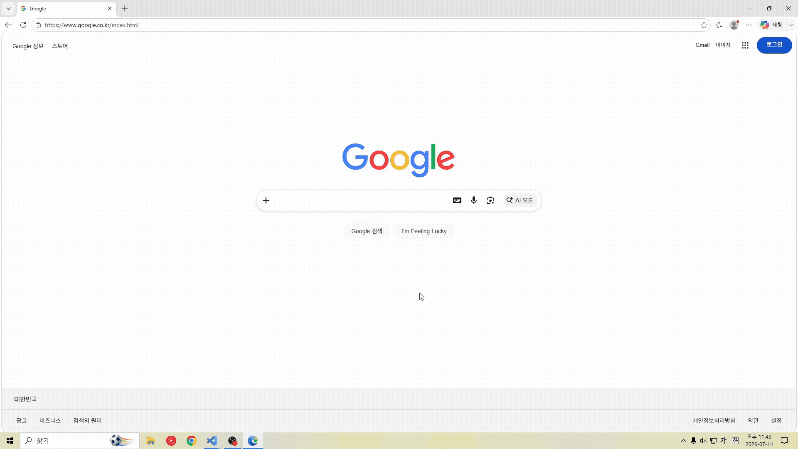
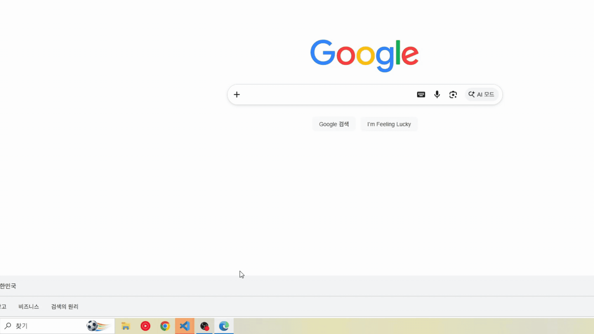

# Job-Finish

**English · [한국어](README.ko.md) · [中文](README.zh.md) · [日本語](README.jp.md)**

Stop staring at your terminal to check whether the AI agent is done.
The instant Claude Code is waiting for your input or a Claude Code/Codex task finishes, a Windows notification brings you back.

| Toast notification | Taskbar flashing |
| :---: | :---: |
|  |  |
| Click the toast to jump back to VS Code | The target window flashes until you return |


## Features

- Claude Code + Codex support - Hooks up Claude Code's `Stop` / `AskUserQuestion` and Codex's `notify` events in one shot.
- Native Windows notifications - Shows task completions, input prompts, and the last agent message as toast notifications.
- Abnormal-stop alerts - Also notifies when Claude Code halts on a usage/session limit or an API error, with a distinct title (`Usage limit reached` / `API error`) so you can tell it apart from a normal finish at a glance.
- Click the notification to return to VS Code - Tapping the toast finds your existing VS Code window and brings it to the front.
- Open the project even when the window is gone - If the target VS Code window was closed, it reopens the project window with `code -n <project>`.
- Focus awareness - Skips the notification if you are already looking at VS Code, and when it regains focus, clears only that window's notifications.
- Taskbar flashing - Even if you miss the notification, the target window flashes in the taskbar. Choose from `30s`, `5m`, `10m`, or `infinite`.
- Sound alerts - Hear task completions through the OS default notification sound.
- global / project install - Choose an install scope for your entire account or just the current project.
- Safe settings merge - Adds only the hooks it needs without overwriting your Claude/Codex settings, and leaves a `.bak` backup before making changes.
- Duplicate notification prevention - Cleans up leftovers from previous Job-Finish hooks and detects Codex notify conflicts.
- Diagnostics and preview - Use the `doctor` and `preview` commands to quickly check the current install and notification behavior.
- VS Code only, by design - Desktop clients like Codex Desktop, Claude Desktop, and Orca ADE ship their own built-in alerts, which would collide with Job-Finish. So notifications and taskbar flashing fire only when the agent is running inside VS Code; hooks triggered from those other environments are skipped.

## Supported Targets

| Target | Integration | Notification timing |
| --- | --- | --- |
| Claude Code | `~/.claude/settings.json` or `./.claude/settings.json` hooks | Task completion, `AskUserQuestion` input prompt, usage-limit / API-error stop |
| Codex | `~/.codex/config.toml` `notify` | Task completion, last assistant message |

> Job-Finish is a Windows-only tool. It relies on PowerShell, the Windows toast API, and VS Code window focus handling.

## Installation

```powershell
npx job-finish init
```

The install wizard uses English by default. Append a language code to run it in Korean, Chinese, or Japanese:

```powershell
npx job-finish init ko  # Korean
npx job-finish init zh  # Chinese
npx job-finish init jp  # Japanese
```

The install wizard lets you choose the following.

| Setting | Description |
| --- | --- |
| Install scope | Current project (`./.claude`) or global (`~/.claude`, `~/.job-finish`) |
| Agent | Which tools to connect: Claude Code or Codex |
| Notification mode | Windows toast, taskbar flashing |
| Flash duration | `30s`, `5m`, `10m`, `infinite` |
| Sound | Whether to use the Windows default sound |
| Focus suppression | Whether to skip notifications when you are already looking at the target VS Code window |

Once installation finishes, you can send a test notification right away.

## Usage

```powershell
# Interactive install (English by default; append ko, zh, or jp to change the wizard language)
npx job-finish init

# Check install status and dependencies + test notification
npx job-finish doctor

# Preview a notification with the current settings
npx job-finish preview

# Remove the hooks and the installed files
npx job-finish uninstall
```

To run the local development build:

```powershell
npm install
npm run build
node dist/index.js init
```

## How It Works

```text
Claude Code Stop / AskUserQuestion
or Codex notify
  -> run job-finish-notify.ps1
  -> Windows toast / taskbar flash / sound
  -> on toast click, launch jobfinish-focus://open
  -> jf-focus-vscode.exe locates the existing VS Code window
  -> bring the exact window to the front, or open the project in a new window
```

Job-Finish does more than just pop up a notification. Even when several VS Code windows are open, it uses the project name, cwd, window handle, and process id to find the best-matching window. The notification click and the taskbar flash are designed to point at the same window, so you never get confused even when working on multiple projects at once.

## Installed Files

Depending on the install scope, files are created in one of the locations below.

| Scope | Location |
| --- | --- |
| project | `./.claude/job-finish/` |
| global | `~/.job-finish/` |

Created files:

- `job-finish-notify.ps1`
- `job-finish.config.json`
- `jf-focus-vscode.exe`

In addition, to handle toast clicks on Windows, the `jobfinish-focus://` protocol handler is registered for the current user (`HKCU`).

## Configuration File

`job-finish.config.json` is saved in the install folder. You can edit it directly without reinstalling.

```json
{
  "version": 1,
  "platform": "win32",
  "modes": ["os", "flash"],
  "flashTimeout": "5m",
  "sound": { "enabled": true },
  "suppressWhenFocused": true,
  "clearToastOnFocus": true,
  "debug": false,
  "watchApp": ""
}
```

Debug logging is off by default. Setting `"debug": true` in `job-finish.config.json` generates `job-finish.log` and `jf-focus-vscode.log`; otherwise no logs are created.

## Requirements

- Windows
- Node.js 18+
- PowerShell
- VS Code

`jf-focus-vscode.exe` ships as a self-contained binary, so no separate .NET runtime installation is required.

## Uninstall

```powershell
# Remove the Claude/Codex hooks and the installed files
npx job-finish uninstall

# Remove only the hooks, keep the generated files
npx job-finish uninstall --keep-files
```

## License

MIT
