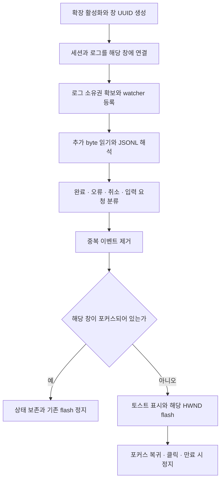

# Job-Finish 기능과 구현 알고리즘 검증

작성일: 2026-10-03. 기준 실측: **2026-10-03 00:11:55 KST**.

이 문서는 기능, 처리 알고리즘, Windows 창 선택·알림 방식, TypeScript 참고 구현, 검증 입력과 실측 결과를 한곳에 보관한다. 다른 기획·검증 문서나 삭제된 테스트 파일을 열지 않고 구현 내용을 확인할 수 있도록 본문과 부록에 필요한 내용을 편입했다.

## 구현할 기능

1. 포커스하지 않은 VS Code 창에서 Codex·Claude Code 작업이 완료되거나 한도·오류 등으로 중단되거나 질문에 대한 상호작용이 필요하면 toast 또는 flash로 알린다.
2. 여러 VS Code 창에서도 창 ID로 작업을 구분하고 해당 창을 보고 있지 않을 때 알린다.
3. watcher와 감지에 필요한 상태를 상주시킨다. 변화가 감지될 때 추가된 내용만 읽어 알림을 만들고, 메모리 사용과 별도 프로세스 실행을 최소화한다.

**검증된 경로는 실제 AI 호출 → 구조화된 로그 감지 → 상태·본문 추출 → 창별 결과 분리다.** 기존 Windows 버전의 HWND 선택·flash 구현과 당시 검증도 이 문서에 포함했다. TypeScript MVP에서는 비포커스 조건·Windows toast/flash·질문 감지를 구현하지 않았으며 메모리 사용량도 측정하지 않았다. 해당 부분의 구현 규칙은 아래에 제시하지만 이미 통과한 실측으로 취급하지 않는다.

## 전체 처리 구조



검증 경로와 제품의 알림 경로는 같은 watcher·파서를 사용한다. 소스 파일 수정, 터미널 프로세스 종료, 로그가 한동안 변하지 않는다는 사실만으로 완료를 판정하지 않는다.

초기 실행 범위는 Windows의 로컬 VS Code Node.js Extension Host다. `onStartupFinished`로 활성화하고 watcher·이벤트 구독·flash 타이머를 확장 생명주기에 연결한다. 원격 로그 감시와 로컬 Windows 알림을 함께 지원하려면 감지 측과 로컬 알림 측을 나누어야 한다. 브라우저 전용 VS Code는 이 구현 범위에 포함하지 않는다.

## 1. 포커스하지 않은 창의 작업 상태 알림

### 세션 연결과 신호 형식

기존 Codex·Claude 사용 화면은 유지한다. 신호의 연결은 확장이 직접 실행한 session/thread ID 또는 사용자가 명시적으로 선택한 세션 로그에 기반한다. 원본 로그의 `cwd`나 전역 최신 파일만으로 원래 창을 추정하지 않는다.

기본 로그 선택 위치는 Codex의 사용자 홈 `.codex/sessions`, Claude의 `.claude/projects`다. 실제 실행 환경에 다른 저장 위치가 있으면 사용자가 지정한 경로를 우선한다. JSONL 파일 경로는 세션 후보 탐색에 사용하고, 연결 후에는 그 파일만 감시한다. 검증 당시 자동 탐색은 실행에서 받은 session ID를 파일명과 대조하는 절차였으며 기존 확장의 모든 세션을 자동 구독한 것이 아니다.

직접 호출 stdout인 `runtime`과 디스크 원본 로그인 `transcript`는 별도 adapter로 해석한다. 부록의 `SignalParser`가 당시 검증된 구현이다.

```typescript
type Provider = "codex" | "claude";
type LogFormat = "runtime" | "transcript";
type NotificationStatus =
  | "completed" | "responseObserved" | "error"
  | "cancelled" | "waitingForInput" | "unknown";

interface SessionBinding {
  windowInstanceId: string;
  provider: Provider;
  sessionId: string;
  logPath: string;
  format: LogFormat;
  source: "ownedExecution" | "userSelection";
}
```

`waitingForInput`과 `unknown`은 제품에서 사용할 상태다. 부록의 실측 MVP 파서는 `completed`, `responseObserved`, `error`, `cancelled`만 구현했다.

### provider별 판정 규칙

| 입력 | 상태를 만드는 기록 | 본문과 식별 정보 | 검증 수준 |
| --- | --- | --- | --- |
| Codex runtime | `turn.completed` → `completed` | `thread.started.thread_id`; 직전 `item.completed`의 `agent_message.text` | 실제 호출 통과 |
| Codex runtime | `turn.failed` 또는 `error` → `error` | `error.message` 또는 `message` | 코드 경로만 확인 |
| Claude runtime | `type: result`, `subtype: success`, `is_error: false` 모두 충족 → `completed` | `session_id`, `result`, `uuid` | 실제 호출·단위 검증 통과 |
| Claude runtime | 나머지 `result` → `error` | `result` 또는 `errors` | 성공/오류·`error_max_turns` 분류 단위 검증 통과 |
| Codex transcript | `event_msg`, `payload.type: task_complete`, `turn_id` 존재 → `completed` | `session_meta.payload.id`, `turn_id`, `last_agent_message` | 원본 로그 수신 통과 |
| Codex transcript | `event_msg`, `payload.type: turn_aborted`, `turn_id` 존재 → `cancelled` | session ID와 `turn_id` | 단위 검증 통과 |
| Claude transcript | 일반 `assistant`, `message.stop_reason: end_turn`, text 본문 존재 → `responseObserved` | `sessionId`, `message.id` 또는 `uuid`, text 블록 결합 | 원본 로그 수신·단위 검증 통과 |

Claude transcript의 `isSidechain`, `isApiErrorMessage`, `tool_use`는 성공 완료로 처리하지 않는다. Codex `agent_message/final_answer`만 존재할 때에도 완료를 만들지 않는다. Claude `end_turn`은 응답 종료 감지이며 관련 도구나 백그라운드 작업의 전체 종료를 보장하지 않는다. Codex `task_complete`는 해당 턴 종료다.

Codex runtime의 `turnId`는 `turn.started`마다 증가하는 내부 순번이고 native `turn_id`와 다른 값이다. native 기록에는 session과 native 턴 ID를 사용한다. 형식을 알 수 없는 기록은 성공으로 추정하지 않고 진단한다.

입력 형태의 최소 예시는 다음과 같다. 실제 provider 로그는 추가 필드를 포함할 수 있다.

```jsonl
{"type":"thread.started","thread_id":"codex-session"}
{"type":"turn.started"}
{"type":"item.completed","item":{"type":"agent_message","text":"작업 응답"}}
{"type":"turn.completed"}
```

```jsonl
{"type":"result","session_id":"claude-session","subtype":"success","is_error":false,"result":"작업 응답","uuid":"result-id"}
{"type":"result","session_id":"claude-session","subtype":"error_max_turns","is_error":false,"errors":["turn limit"]}
```

```jsonl
{"type":"session_meta","payload":{"id":"codex-session"}}
{"type":"event_msg","payload":{"type":"task_complete","turn_id":"turn-id","last_agent_message":"작업 응답"}}
{"type":"event_msg","payload":{"type":"turn_aborted","turn_id":"cancelled-turn"}}
```

```jsonl
{"type":"assistant","sessionId":"claude-session","message":{"id":"message-id","stop_reason":"end_turn","content":[{"type":"text","text":"작업 응답"}]}}
```

### 한도·오류·질문에 따른 상호작용

오류 `result`와 native 취소 기록을 성공으로 바꾸지 않는다. `error_max_turns`는 실행 턴 수 제한이며 계정 사용량 제한과 동일한 사건으로 취급하지 않는다. 실제 사용량 제한·API 오류의 세부 분류는 해당 설치 버전의 실패 기록을 확보한 뒤 adapter에 추가한다.

질문 감지는 일반적인 `tool_use`를 모두 입력 대기로 처리하지 않는다. 실제 `AskUserQuestion` 또는 승인이 필요한 이벤트의 요청 ID·질문 본문·아직 해결되지 않은 상태를 확인하고 `waitingForInput`으로 만든다. 사용자 응답 기록이 오면 그 요청을 해제한다. 질문 요청 ID를 중복 키로 써서 같은 질문을 반복 알리지 않는다. 이 이벤트의 hook 없는 실제 로그 스키마는 아직 실측되지 않았으므로 확정된 필드명으로 구현했다고 기록하지 않는다.

부록의 참고 구현만으로 입력 대기를 검출할 수 있는 것은 아니다. 완료·입력 요청·사용량 제한·API 오류·취소 각각의 실제 로그 fixture를 확보하고 상태 분류를 검증해야 세 기능 전체의 완료 기준을 충족한다.

### 알림 판단

신호를 받은 창의 `vscode.window.state.focused`를 알림 직전에 확인한다. 이미 보고 있는 창이면 새 toast/flash를 시작하지 않고 해당 창의 실행 중인 flash를 정리한다. 다른 창이 포커스되어 있다는 사실은 이 창의 알림을 생략할 이유가 아니다.

```text
신호 수신
  연결한 세션의 신호인가? 아니면 무시
  이미 처리한 이벤트인가? 맞으면 무시
  상태·본문·세션·창 ID를 제한된 결과 저장소에 기록
  해당 창이 focused인가? 맞으면 해당 flash 정지 후 종료
  toast 설정이 켜졌으면 provider·상태·본문·창 ID로 표시
  flash 설정이 켜졌고 HWND가 확인되면 그 HWND에만 시작
```

알림 본문은 기존 응답을 사용하고 요약을 위한 AI 호출은 추가하지 않는다. Windows 토스트 본문은 기존 구현처럼 최대 180자로 제한하고, 전체 본문이 필요하면 제한된 결과 저장소나 로그 원문을 다시 읽는다.

### Windows 토스트 구현

VS Code `showInformationMessage()`는 VS Code 내부 팝업이다. Windows 시스템 토스트는 로컬 Node.js에서 native 알림 adapter를 호출해야 한다. C# 구현으로 돌아갈 필요는 없으며, TypeScript 호출 계층에서 Windows 알림 라이브러리 또는 native 모듈을 사용할 수 있다.

구체적인 구현 선택지는 `node-notifier`의 `WindowsToaster`가 포함하는 SnoreToast 실행 파일을 사용하는 것이다. 이 경우 TypeScript 코드는 알림 호출을 제어하고 라이브러리가 Windows native 전송을 담당한다. VSIX에는 필요한 실행 파일을 포함한다. 외부 상주 서비스를 필수로 만들지 않고 알림 요청에 필요한 동안만 실행한다.

토스트 adapter는 다음 입력을 받도록 구성한다.

```typescript
interface ToastRequest {
  notificationId: string;
  windowInstanceId: string;
  title: string;
  message: string;
  appId: string;
  onClick?: () => void;
}
```

기존 Windows 구현의 앱 ID는 `JobFinish.VisualStudioCode`, 표시 이름은 `Visual Studio Code`, 그룹은 `job-finish`였다. Job-Finish 소유 시작 메뉴 바로가기에 동일한 AppUserModelID를 지정하고 그 ID로 전송했다. 토스트 XML은 본문과 launch 값을 XML escape한 뒤 WinRT `ToastNotificationManager.CreateToastNotifier(appId).Show(toast)`에 전달했다. 태그는 `jf-<hwnd>`였다. 전송 실패 시 한 번 재시도하고 balloon fallback을 사용했다.

새 adapter에서도 앱 ID 등록과 전송 ID가 일치해야 한다. 기존 WinRT 방식 자체를 선택하면 바로가기 AppUserModelID 설정과 토스트 활성화 처리를 native 계층에서 구현한다. SnoreToast 방식이면 제공되는 등록·전송 기능을 사용한다. 토스트 클릭 callback이 살아 있는 확장으로 전달되면 해당 알림의 flash를 정지한다. 알림 센터에서 나중에 클릭하거나 확장이 종료된 상황까지 지원하려면 별도 활성화 경로가 필요하며 이번 실측에는 포함되지 않았다.

## 2. 여러 창의 식별과 해당 HWND만 flash

### 창 UUID, 세션, 소유권

`activate()`마다 `crypto.randomUUID()`로 창 실행 ID를 생성한다. 같은 workspace의 여러 창에서도 UUID를 공유하지 않는다. `vscode.env.sessionId`, workspace URI, Extension Host PID는 진단 정보로 기록한다. 재시작·확장 재활성화 후에는 새 UUID를 만든다.

각 watcher는 연결한 `provider`, `sessionId`, `logPath`와 해당 UUID를 참조한다. 신호가 생기면 그 UUID를 붙여 그 창에서 처리한다. 다른 창으로 전달하는 중앙 라우터를 필수로 만들지 않는다.

같은 host/profile의 `globalStorageUri/owners`에서 로그 경로별 소유권을 조정한다. Windows에서는 `path.resolve(logPath).toLowerCase()`로 정규화하고 SHA-256을 lock 이름으로 사용한다. `open(lockPath, "wx")`가 성공한 소유자 하나만 감시한다. lock에는 임의 token과 UUID·로그 경로를 기록하고 정상 해제 시 token이 일치할 때만 삭제한다.

이 배타성의 범위는 공통 조정 저장소의 같은 파일 경로다. 테스트에서는 별도 프로필들이 명시적으로 같은 조정 디렉터리를 사용했다. 비정상 종료 lock 자동 회수·소유권 이전은 검증하지 않았다. 강제 종료 복구를 구현할 때에는 살아 있는 소유자가 있는지 확인한 뒤 회수하며 token을 검사한다.

중복 제거는 watch별 키로 한다.

| 기록 | 중복 키 |
| --- | --- |
| Codex native 완료 | `sessionId:turn_id:complete` |
| Codex native 취소 | `sessionId:turn_id:aborted` |
| Claude native 응답 | `message.id`, 없으면 `uuid`, 다음 기록 위치 |
| Claude runtime 결과 | `uuid`, 없으면 기록 위치 |
| Codex runtime | 파일 generation과 행 sequence의 조합 |
| 추가 구현할 질문 | session ID와 실제 질문 request ID |

기록 위치 fallback에서는 같은 내용이 새 위치에 추가되면 별도 이벤트가 될 수 있다. 재시작 때 과거 기록 재알림을 막은 실측 방법은 기존 완료 키 복원이 아니라 새 파일 끝 기준점이다.

### UUID와 Windows HWND의 연결

UUID는 확장 실행 식별자이고 HWND는 Windows의 실제 창 핸들이다. 둘을 같은 값으로 쓰지 않는다. Windows flash adapter에는 선택한 HWND를 별도로 제공한다.

연결 정보는 `windowInstanceId`, `hwnd`, native 창 PID, 확인 방식·시각을 포함한다. 실행 직전 `IsWindow(hwnd)`와 대상 프로세스를 다시 확인하고 창이 사라지거나 재활성화되면 연결을 버린다. 여러 창이 같은 Code PID를 공유할 수 있으므로 PID 단독으로 창을 결정하지 않는다.

기존 버전의 후보 선택 흐름과 점수는 다음 절에 모두 보관했다. 서로 다른 프로젝트·제목을 가진 창에는 당시 재현 근거가 있다. **같은 프로젝트·같은 제목의 여러 창을 구분하는 HWND 연결은 별도 검증이 필요하다.** 제목 점수 동률의 ZOrder를 정확한 소유권으로 간주하지 않는다. 모호한 경우 잘못된 창을 flash하는 대신 HWND 미연결 상태로 남겨 토스트에 창 UUID를 표시한다.

새 확장에서는 해당 창이 포커스될 때 `onDidChangeWindowState`와 native 전경 HWND를 함께 관측해 UUID 연결 후보를 확보하거나 명시적인 연결 명령을 제공할 수 있다. 포커스 이벤트 처리 지연 중 전경 창이 바뀔 수 있으므로 그 관측만으로 완전한 연결을 보장한다고 선언하지 않는다. 같은 폴더 두 창과 빠른 포커스 전환을 재현해 연결 절차를 확인해야 한다.

### TypeScript에서 호출할 Windows 함수

Windows native 호출은 예를 들어 Koffi 같은 Node.js FFI 모듈로 `user32.dll`을 로드해 수행한다. 이는 TypeScript로 호출을 작성하는 방식이며 native 의존성은 VSIX에 포함한다. Electron main process의 `BrowserWindow`나 HWND 접근이 일반 VS Code 확장 API로 제공된다고 가정하지 않는다.

| Win32 함수 | 역할 |
| --- | --- |
| `EnumWindows(callback, lParam)` | 최상위 창 열거 |
| `IsWindowVisible(hwnd)` | 보이는 후보만 선택 |
| `GetWindowTextW(hwnd, buffer, count)` | UTF-16 창 제목 읽기 |
| `GetWindowThreadProcessId(hwnd, out pid)` | HWND의 프로세스 PID |
| `IsWindow(hwnd)` | 핸들의 유효성 확인 |
| `GetForegroundWindow()` | 현재 전경 HWND |
| `FlashWindow(hwnd, invert)` | 특정 창 flash 상태 변경 |
| `FlashWindowEx(FLASHWINFO*)` | 시작·정지와 깜빡임 정책 |

`HWND`는 pointer 크기를 유지해 표현하고 임의의 32bit 정수로 잘라내지 않는다. Win32 `BOOL`은 32bit 정수, `UINT`·`DWORD`는 unsigned 32bit다. 32bit 플랫폼에서는 함수 호출 규약도 맞춰 선언한다. callback을 사용하는 `EnumWindows`는 native 호출이 끝날 때까지 callback 수명을 유지한다.

`FLASHWINFO` 레이아웃은 다음과 같다.

```c
typedef struct {
  UINT  cbSize;
  HWND  hwnd;
  DWORD dwFlags;
  UINT  uCount;
  DWORD dwTimeout;
} FLASHWINFO;
```

`cbSize`는 native struct의 실제 크기다. pointer 정렬을 반영하면 Windows x64에서는 32byte, x86에서는 20byte다. 하드코딩보다 FFI struct size 기능으로 구한다.

| flag | 값 |
| --- | ---: |
| `FLASHW_STOP` | 0 |
| `FLASHW_CAPTION` | 1 |
| `FLASHW_TRAY` | 2 |
| `FLASHW_ALL` | 3 |
| `FLASHW_TIMER` | 4 |
| `FLASHW_TIMERNOFG` | 12 |

`FlashWindowEx` 반환값은 호출 전 창의 활성 상태이며 단순한 성공 bool로 취급하지 않는다. 실제 시각 효과와 대상 HWND·포커스 전환을 함께 확인한다.

### flash 수명과 정지

선택한 HWND에만 flash 상태를 둔다. 같은 창에 새 알림이 오면 기존 타이머를 먼저 정리하고 최신 활성 알림을 관리한다. 알림별 `notificationId`를 창 UUID와 구분한다.

기존 버전과 동일하게 500ms interval의 manual flash 방식을 선택하면 알림 발생 후에만 타이머를 만든다. `FlashWindow(hwnd, true)`로 시작하고 다음 tick 전에 HWND 유효성, 해당 창 포커스 복귀, 알림 정지 요청, 만료를 확인한다.

```text
startFlash(hwnd, notificationId, timeout)
  기존 같은 HWND flash가 있으면 정지
  HWND와 전경 상태 재확인
  FlashWindow(hwnd, true)
  500ms 간격의 타이머 등록
    HWND가 없어졌거나 해당 HWND가 전경이거나 클릭/정지 요청이거나 만료면 stop
    아니면 FlashWindow(hwnd, true)

stopFlash(hwnd)
  해당 타이머 해제
  유효한 HWND면 FlashWindow(hwnd, false)
  FlashWindowEx({ cbSize, hwnd, dwFlags: 0, uCount: 0, dwTimeout: 0 })
  해당 알림·타이머 상태 제거
```

native OS 자체 반복을 사용하는 대안은 `FLASHW_TRAY | FLASHW_TIMERNOFG`다. 기존 코드의 워커 시작 실패 fallback은 `dwFlags = 15`, `dwTimeout = 500ms`, timeout으로 계산한 count였다. 같은 HWND에 manual timer와 OS 반복을 동시에 시작하지 않는다.

TypeScript에서는 이 수명을 확장 내부 타이머로 관리해 알림마다 PowerShell 워커를 만들 필요가 없다. 기본 예시 만료는 기존 설정의 5분이며 포커스 복귀 시 즉시 종료한다. timeout을 무제한으로 제공하면 명시적 정지와 확장 종료 정리를 유지한다. 이는 새 구현 방향이고 TypeScript MVP에서 flash가 실측됐다는 뜻은 아니다.

### 기존 Windows 알고리즘과 실측 기록

다음 내용은 v1.0.2의 원본 코드와 당시 기록에서 편입했다. 출처 revision은 `877024beb5f86c390c1beec4992cf64c862dbc67`; 삭제 직전 `e44e319dce053a8ae16e13c2b9673585889b9cf4`의 관련 코드와 동일했다. 출처는 식별 정보이며 구현에 원본 링크를 열 필요는 없다.

당시 실제 flash 시작은 PowerShell notifier의 내장 C# P/Invoke와 flash 워커가 맡았고, 토스트 클릭 후 포커스 이동·flash 정지는 별도 C# helper가 맡았다. 다음에 원본의 판단 순서, 점수, 정지 조건을 편입한다.
#### 작업 창의 HWND를 찾는 순서

작업 위치는 payload의 `cwd`, Codex 세션의 `cwd`, 사용 가능한 실행 디렉터리 순으로 정했다. 그 위치의 마지막 폴더명을 `project`로 사용했다.

`Get-VSCodeWindow`는 다음 순서로 창을 찾는다.

1. 작업 위치가 확인되면 `EnumWindows`로 보이는 `Code` 창을 열거하고 제목에 `project`가 들어가는 창을 찾는다.
2. 위치를 확인할 수 없으면 보이는 Code 창이 정확히 하나인 경우에만 그 창을 반환한다.
3. 위치를 확인했지만 제목 탐색에 실패하면 `VSCODE_PID`의 창에서 프로젝트 제목을 다시 찾는다. 제목 없는 PID fallback과 `MainWindowHandle` fallback은 Code 창이 하나일 때만 허용한다.
4. 마지막으로 실행 중인 Code PID 목록에 대해 제목을 대조한다. 찾지 못하면 HWND 0을 반환한다.

별도로 `Get-HostWindow`는 notifier의 부모 프로세스 트리를 최대 12단계 올라가며 HWND를 찾는다. 먼저 트리에 속한 PID와 프로젝트 제목을 함께 대조한다. 이후 Code 창이 하나인 경우의 fallback, 다른 부모 프로세스의 `MainWindowHandle`, 콘솔 HWND를 차례로 확인한다.

최종 flash 대상은 `Get-VSCodeWindow`의 결과가 있으면 그 HWND, 없으면 host HWND다. 프로젝트 정보가 확인된 경우 제목 탐색으로 얻은 Code 후보의 신뢰 조건도 검사한다. 2026-07-12 수정에서는 host Code HWND를 하위 폴더명과 제목이 다르다는 이유로 버리는 조건을 제거했다.

#### 여러 창에서 알림과 flash가 분리된 방식

핵심은 **PID와 별도로 최종 대상 HWND를 유지하는 것**이다. 실제로 여러 VS Code 창이 같은 Code PID를 공유했던 기록이 있다.

1. `GetForegroundWindow()`로 현재 전경 HWND를 읽는다.
2. 전경 HWND가 최종 대상 HWND와 다르면 그 창의 알림을 생략하지 않는다.
3. 두 HWND가 같고 `suppressWhenFocused` 설정이 켜져 있으면 신뢰 조건을 확인한 뒤 알림을 생략한다. 프로젝트 위치가 확인된 Code 창은 제목 일치 또는 PID 일치와 유일 Code 창 조건을 사용한다.
4. flash를 시작할 때 최종 대상 HWND를 `-WatchFlashHwnd`로 넘긴다. 워커는 전달된 그 HWND만 사용한다.

`Watch-FlashWindow`는 `IsWindow(hwnd)`로 유효성을 확인하고 `FlashWindow(hwnd, true)`를 호출한다. 기본 500ms 간격으로 같은 HWND를 깜빡이며 다음 조건 중 하나가 되면 종료한다.

- 해당 HWND가 사라짐.
- `GetForegroundWindow() == hwnd`가 됨.
- 그 알림의 `activationId`에 해당하는 정지 신호 파일이 생김.
- 설정한 flash 시간이 만료됨.

종료 시 `FlashWindow(hwnd, false)`와 `FlashWindowEx`의 `dwFlags = 0`을 호출해 정리한다. 워커 실행에 실패하면 같은 HWND에 `FlashWindowEx`를 직접 호출한다. 이 fallback의 flag는 15, interval은 500ms다.

토스트 URI에도 HWND와 PID, 제목, 알림별 `activationId`를 넣었다. 사용자가 클릭하면 C# helper가 해당 `activationId`의 정지 신호 파일을 쓰고, 대상 창으로 포커스를 옮긴 뒤 flash 정지를 반복 호출한다. 이 ID는 알림 한 건의 ID이며 현재 TypeScript MVP의 창 UUID와는 역할이 다르다.

기존 정지 신호는 `activationId`에서 문자·숫자·`-`·`_`만 남겨 안전한 파일명으로 만든 뒤 시스템 임시 폴더의 `job-finish-flash-stop-<id>.signal`에 UTC 시각을 기록하는 방식이었다. `StopFlashingWithRetry`는 유효한 HWND에 `FLASHW_STOP`을 4회 전송하고 첫 호출 뒤 35ms, 나머지 호출 뒤 20ms씩 기다렸다. 새 TypeScript 구현에서 같은 확장 안의 토스트 callback과 flash 타이머를 연결하면 정지 신호 파일 대신 해당 `notificationId`의 타이머를 직접 해제할 수 있다.

#### 토스트 클릭 대상의 C# 점수 알고리즘

보이는 최상위 `Code` 창의 점수를 계산하고 **점수 내림차순 → 열거 순서인 ZOrder 오름차순**으로 정렬했다.

| 일치 조건 | 점수 |
| --- | ---: |
| 전달된 PID와 일치 | +10 |
| 제목에 전체 cwd 경로 포함 | +200 |
| 제목에 `titleHint` 포함 | +100 |
| 제목에 cwd의 마지막 폴더명 포함; 그 폴더명이 `titleHint`와 다른 경우 | +90 |

`ResolveTarget`의 강한 후보 기준은 점수 **90 이상**이다.

- 전달된 HWND가 유효하고 그 후보의 점수가 90 이상이면 그 HWND를 사용한다.
- 전달된 HWND의 점수가 낮고 다른 강한 후보가 있으면 그 후보로 보정한다.
- 다른 강한 후보가 없으면 유효한 전달 HWND를 사용한다.
- 전달 HWND가 없거나 무효이면 강한 후보를 사용한다. 강한 후보도 없으면 Code 후보가 하나일 때만 그 창을 사용한다.

이 점수 알고리즘은 **토스트 클릭 시 포커스 대상 보정**에 사용됐다. flash 시작의 대상 선택은 앞서 설명한 notifier의 탐색 흐름이다.

#### 당시 남아 있는 검증 기록

2026-06-13 debug_log.md에 같은 PID를 공유한 두 창의 검증이 남아 있다. 일부러 다른 창의 HWND를 helper에 넣었고, 프로젝트 제목 점수로 올바른 창을 선택해 포커스 이동에 성공했다.

```text
candidate hwnd=1573752 pid=20916 score=110 title="Debug notification system - Job-Finish - Visual Studio Code"
candidate hwnd=4327068 pid=20916 score=10 title="... - DsTurn_Temp - Visual Studio Code"
explicit hwnd did not match cwd/title; using scored target hwnd=1573752 score=110
foreground.after=hwnd=1573752 pid=20916 process=Code title="Debug notification system - Job-Finish - Visual Studio Code"
success=True
```

이 기록은 서로 다른 제목을 가진 두 창에서 같은 PID로 인한 대상 오인을 보정한 실측이다. 같은 프로젝트·같은 제목의 여러 창을 구분한 실측은 아니다.


원본의 관련 변경 이력은 `d6fe92b`의 다중 창 포커스 분리, `6ac03f7`의 PID 가중치 1000→10 및 제목 점수 보정, `8dad381`의 Codex 세션 cwd와 flash 워커, `8e3e1b4`의 클릭 시 알림별 정지 신호, `db80911`의 하위 폴더 작업 시 host HWND 보존이다.

### 원본 C# 선택 규칙을 TypeScript로 표현

다음은 당시 `ScoreWindow`와 `ResolveTarget`의 판단을 옮긴 참고 코드다. native 창 열거·유효성 호출은 앞의 Win32 adapter에서 제공한다. 원본처럼 ZOrder를 마지막 tie-breaker로 사용하며 동률 후보를 정확한 UUID 연결로 보장하지 않는다.

```typescript
type Hwnd = string; // native pointer를 보존한 문자열 표현
interface Candidate { hwnd: Hwnd; pid: number; title: string; zOrder: number; score: number }
function scoreWindow(w: Candidate, cwd: string, hint?: string, preferredPid?: number): number {
  const title = w.title.toLowerCase();
  const normalized = cwd.replace(/[\\/]+$/, "");
  const folder = normalized.split(/[\\/]/).pop() ?? "";
  let score = preferredPid && w.pid === preferredPid ? 10 : 0;
  if (normalized.trim() && title.includes(normalized.toLowerCase())) score += 200;
  if (hint?.trim() && title.includes(hint.toLowerCase())) score += 100;
  if (folder.trim() && folder.toLowerCase() !== (hint ?? "").toLowerCase()
      && title.includes(folder.toLowerCase())) score += 90;
  return score;
}
function resolveTarget(explicit: Hwnd | undefined, input: Candidate[],
                       isWindow: (h: Hwnd) => boolean): Hwnd | undefined {
  const windows = [...input].sort((a, b) => b.score - a.score || a.zOrder - b.zOrder);
  const best = windows.find(w => w.score >= 90);
  if (explicit && isWindow(explicit)) {
    const requested = windows.find(w => w.hwnd === explicit);
    if (requested) {
      if (requested.score >= 90 || !best || best.hwnd === explicit) return explicit;
      return best.hwnd;
    }
    return best?.hwnd ?? explicit;
  }
  return best?.hwnd ?? (windows.length === 1 ? windows[0].hwnd : undefined);
}
```

## 3. watcher 중심의 상주와 메모리 최소화

### 연결 후 증분 읽기

watcher는 `new RelativePattern(dirname(logPath), basename(logPath))`처럼 파일 하나로 좁힌다. watcher를 먼저 등록하고 파일 크기 기준점을 초기화한 뒤 다시 한 번 drain한다. 직접 AI 호출은 준비가 끝난 뒤 시작한다.

읽기 상태는 byte `offset`, UTF-8 `StringDecoder`, 미완성 행 `remainder`, 파일 inode, generation, 행 sequence다. 파일별 Promise queue로 순서를 보장한다.

1. 기본 연결은 `offset = 현재 파일 크기`로 시작해 과거 완료를 다시 알리지 않는다.
2. 연결 시 마지막 byte가 줄바꿈이 아니면 그 과거 미완성 행의 나머지도 첫 줄바꿈까지 버린다.
3. create/change/delete 이벤트가 오면 `stat()`으로 크기를 확인하고 offset 이후만 최대 64 KiB씩 읽는다.
4. decoder에 byte를 넣고 줄바꿈까지 완성된 JSONL 행만 `JSON.parse()`한다. 나머지는 다음 쓰기까지 유지한다.
5. inode가 달라지거나 크기가 offset보다 작으면 읽기 상태를 재설정하고 generation을 올린다. 파일이 없으면 이번 읽기를 종료한다.
6. 파싱 실패는 진단하고 해당 행을 성공 신호로 바꾸지 않는다.
7. CLI 직접 호출 종료 시 stdout 저장 queue를 먼저 기다린 뒤 마지막 drain으로 coalesced watcher 이벤트를 보완한다.

실측에서는 문자·JSON 분할, truncate, 완성/미완성 과거 행 생략이 통과했다. 파일 교체·삭제 후 재생성 분기는 참고 구현에 있으나 별도 실측 항목은 아니다. 주기적 전체 로그 조회와 별도 debounce 타이머는 당시 MVP에 없었다.

기본 연결의 과거 생략과 자동 재시작 복구는 구분한다. 당시 MVP는 offset·완료 키를 저장해 복원하지 않았고, 종료 후 재연결도 새로운 파일 끝 기준점으로 시작했다. 감시가 꺼진 동안의 완료를 새 알림으로 전달하는 기능은 검증하지 않았다.

### 메모리와 프로세스 수명

감시를 위해 별도 AI 프로세스를 계속 실행하지 않는다. 상주 상태는 watcher, offset·decoder, 연결 정보, 마지막 응답, 제한된 중복 키·결과 목록이다. 실제 CLI 프로세스는 연결 검증 요청 중에만 실행했다.

새 제품의 기본 상한 예시는 다음과 같이 둔다. 이 값은 구현 기준 예시이고 측정된 최적값은 아니다.

| 항목 | 기본 상한·정리 규칙 |
| --- | --- |
| 한 번의 파일 읽기 | 64 KiB |
| 미완성 JSONL 행 | 1 MiB; 초과 시 오류 진단 후 다음 줄바꿈까지 버려 스트림 복구 |
| 최근 결과 본문 | 창별 최대 20건, 건당 16 KiB; 원문 전체는 필요할 때 파일에서 조회 |
| 진단 오류 | 최근 100건 |
| 중복 키 | 로그별 최근 512개; 활성 턴의 최종 키는 턴 종료 기준으로 유지 |
| flash 타이머 | 창별 최대 1개; 포커스 복귀·만료·해제 시 삭제 |

중복 키를 제한하면 오래된 키가 다시 등장할 때 재알림될 수 있으므로 완료 watermark와 replay 범위를 함께 정한다. 구현 상한을 `exactly once`의 무제한 보장으로 표현하지 않는다.

당시 MVP의 신호 배열·오류 배열·중복 `Set`·미완성 행 버퍼에는 이 상한이 없었다. 64 KiB는 한 번의 읽기 크기이며 총 메모리 상한이 아니다. 메모리 최소화 완료를 확인하려면 장시간 append·많은 세션·대형 미완성 행 시나리오에서 heap과 프로세스 증가를 별도로 측정한다.

감시 해제 시 이벤트 구독과 watcher를 dispose하고 읽기 queue를 정리한 뒤 자기 token의 소유권을 해제한다. 확장 비활성화 시 자신이 시작한 probe 프로세스와 모든 flash 타이머·watcher를 정리한다. 부록의 참고 코드는 당시 실제 구현이며 새 메모리 상한·flash 처리는 별도로 적용해야 한다.

## 실제 검증 방법과 결과

### 실행 환경

| 항목 | 당시 실측 |
| --- | --- |
| 시각 | 2026-10-03 00:11:55 KST / 2026-10-02T15:11:55.147Z |
| OS | Windows x64 |
| VS Code | 1.140.0 |
| Codex | openai.chatgpt 26.930.21537에 포함된 codex-cli 0.159.0-alpha.12.1 |
| Claude | anthropic.claude-code에 포함된 Claude Code 2.1.287 |
| 추가 호출 확인 | 독립 설치 Claude Code 2.1.233에서도 호출·원본 로그 감시 통과 |
| Host | @vscode/test-electron을 통해 설치된 Code.exe의 실제 Extension Host 실행 |

manifest의 최소 API 기준은 VS Code 1.100.0이었다. 실측 통과 버전은 1.140.0이며 모든 하위 버전이 검증된 것은 아니다. App Server·Agent SDK를 사용한 실측이 아니라 CLI 직접 호출이다.

### 핵심 로직 검사 다섯 가지

| 입력·절차 | 검사 조건과 당시 결과 |
| --- | --- |
| 과거 `{"old":true}` 행 후 `{"text":"완료"}`를 한글 첫 byte에서 나누어 append, 이후 파일 truncate | 과거 신호 0개, 분할 중 0개, 완성 후 정확한 한글, truncate 후 새 행, 파싱 오류 0개; 통과 |
| 파일 끝에 `{"old":`가 있는 상태에서 연결한 뒤 `true}`와 새 live 행 추가 | 완성된 과거 행은 버리고 live 행만 수신; 통과 |
| Claude success+is_error:true, error_max_turns+is_error:false, success+is_error:false 및 native end_turn/sidechain/API 오류/tool_use | 각각 error/error/completed, 일반 end_turn은 responseObserved, 나머지는 무시; 통과 |
| Codex final_answer 단독, 같은 native task_complete를 다른 기록 위치로 전달, turn_aborted | final 단독 신호 없음, 종료 키 동일, 취소 cancelled; 통과 |
| 같은 로그의 두 소유권 요청을 동시에 실행하고 승자 해제 후 다시 획득 | 정확히 하나 성공, 해제 후 새 소유자 성공; 통과 |

### 실제 두 창 검사 절차

1. 같은 workspace와 다른 workspace 두 시나리오를 준비한다. A/B에 별도 user-data-dir를 사용하고 테스트 조정 영역만 명시적으로 공유한다.
2. 두 Host에서 확장을 활성화하고 UUID와 workspace URI를 서로 대조한다.
3. A/B는 각각 자기 빈 로그를 연결한다. B가 A 로그를 연결하면 소유권 오류가 나야 한다.
4. 각각 `WINDOW_A_완료`, `WINDOW_B_완료`인 Codex task_complete JSONL을 한글 첫 byte에서 나누어 쓴다. 첫 부분 후 250ms 동안 신호 0개를 확인하고 완성 후 자기 신호 1개를 기다린다.
5. 같은 종료 행을 다시 쓰고 700ms 후에도 신호 1개인지 확인한다. 본문·UUID가 자기 창과 일치하고 실제 watcher 이벤트가 1회 이상인지 검사한다.
6. VS Code 문서를 WorkspaceEdit로 바꾸어 문서 변경 이벤트 수신을 확인한다.
7. 같은 workspace의 실제 호출 검증은 A의 Codex와 B의 Claude로 수행한다. 각 provider를 한 번 새 호출하고 원본 로그를 연결한 뒤 같은 세션을 한 번 재개한다.
8. A/B 창이 종료된 뒤 A 프로필을 재실행한다. UUID가 달라지고 기존 기록을 700ms 동안 재생하지 않으며 새로운 완료 행은 수신하는지 검사한다.

이 실측은 별도 프로필의 두 Host에서 진행했다. 한 VS Code 메인 프로세스와 동일 프로필 아래의 여러 창 조합은 별도로 재현하지 않았다.

새 호출의 stdout 파일은 종료 후 최종 drain을 했다. native 세션 로그는 watcher를 연결한 뒤 재개했고, 종료 후 1초 동안 생긴 신호를 확인했으며 native watcher에 별도 flush를 호출하지 않았다. poll 대기는 100ms 간격, 일반 조건 timeout은 30초였다.

| 실제 AI 호출 경로 | 본문 | proof | 상태 |
| --- | --- | --- | --- |
| A Codex 새 호출 | JF_LIVE_A | turn.completed | completed |
| B Claude 새 호출 | JF_LIVE_B | result/success | completed |
| A Codex 원본 로그 재개 | JF_NATIVE_A | event_msg/task_complete | completed |
| B Claude 원본 로그 재개 | JF_NATIVE_B | assistant/stop_reason=end_turn | responseObserved |

각 새 호출과 재개 호출의 종료 코드는 0이었다. 각 경로에서 본문이 일치하는 신호가 정확히 1개 수신됐다. 같은 workspace의 A watcher 이벤트는 9회·문서 이벤트 2회, B watcher 7회·문서 6회다. 포커스 이벤트는 모두 0회였고 보관된 오류 배열은 비어 있다.

핵심 로직 5개, 실제 Host의 같은/다른 workspace·종료 후 재실행, 두 provider의 새 호출·재개 호출, TypeScript 빌드와 VSIX 생성은 당시 통과했다. 이번 문서 통합에서는 새 AI 호출, Windows flash 재현, 메모리 실측을 수행하지 않았다.

### 아직 통과하지 않은 기능의 완료 기준

| 기능 | 추가로 재현할 조건 |
| --- | --- |
| 비포커스 toast/flash | A 완료 중 B를 보고 있으면 A만 알림·flash, A를 보고 있으면 생략, 포커스 복귀 시 정지 |
| 실제 Windows 토스트 | OS 알림 영역에 본문·상태 표시, 앱 ID 등록, 클릭 시 해당 알림만 flash 정지 |
| 같은 프로젝트·같은 제목의 HWND 연결 | 서로 다른 UUID가 정확히 서로 다른 native HWND와 연결되고 빠른 포커스 전환에도 유지 |
| 한도·오류·질문 | 실제 계정 사용량 제한, API 오류, 사용자 질문 요청과 응답, 취소를 각각 성공과 구분 |
| 메모리 제한 | 대형 행·많은 세션·장시간 append 이후 상한과 정리 동작 확인 |

실제 테스트는 팝업을 생략하고 신호 목록을 검사했다. Reload Window 명령 자체 대신 창 종료·재실행을 검사했다. 기존 공식 AI 확장 채팅 UI에 입력하거나 그 UI 세션의 모든 완료를 자동 구독한 결과는 아니다.

## 참고 구현을 다시 만드는 방법

부록의 TypeScript 파일 다섯 개를 새 프로젝트의 `src/`에 각각 저장하면 당시 검증한 신호 감지 MVP를 구성할 수 있다. 테스트 코드는 보관하지 않으며 위 입력과 검사 절차로 새 검증을 구성한다. 이 참고 구현은 toast/flash·입력 요청·메모리 상한이 적용된 완성 제품은 아니다.

명령 팔레트의 참고 명령은 `jobFinishMvp.identity`(창 ID), `jobFinishMvp.probe`(실제 CLI 호출), `jobFinishMvp.bind`(원본 로그 연결), `jobFinishMvp.results`(신호·진단)다. provider 실행 경로는 `jobFinishMvp.codexExecutable`, `jobFinishMvp.claudeExecutable`에 지정한다.

native `.exe`를 설정하고 각 provider의 로그인을 먼저 완료한다. 기본 탐색은 사용자 홈 `.local/bin`과 PATH, Windows Codex의 경우 APPDATA/npm/node_modules/@openai 아래의 codex.exe다. `.cmd`나 `.ps1`을 실행 파일 경로로 대신 지정하지 않는다.

CLI 실행은 `spawn(..., { shell: false, windowsHide: true })`이고 프롬프트는 stdin으로 전달한다. stdout 저장을 직렬화한다. Codex는 read-only와 사용자 설정 무시, Claude는 도구·MCP·hook 비활성화로 연결 확인만 수행했다. 구현한 기본 timeout은 120초이고 중지는 자신이 실행한 자식 PID에 한정했다.

새 프로젝트에서 아래 manifest·tsconfig와 소스 파일을 구성한 뒤 `npm install`, `npm run build`를 실행한다. VS Code에서 프로젝트를 열고 Extension Development Host를 띄우거나 `--extensionDevelopmentPath`로 시작해 명령을 사용한다. 실제 모델은 provider당 새 호출과 같은 세션 재개로 각각 두 번 호출했다. 예전 테스트 폴더를 실행하는 명령은 더 이상 현재 저장소의 실행 안내로 쓰지 않는다.

## 부록: 당시 TypeScript 신호 감지 구현

다음 코드는 실행 코드 파일을 별도로 보관하지 않고 이 문서 안에 편입한 당시 구현이다. `extension.ts`의 Test 모드 분기와 검증용 신호 수집 구조도 원래 구현대로 남겨 동작을 확인할 수 있게 했다. 제품 코드에서는 본문의 비포커스 조건·Windows adapter·저장 상한을 적용한다.
### package.json

검증 도구와 테스트 실행 스크립트를 제외한 참고 실행 manifest다.

```json
{
  "name": "job-finish-mvp",
  "displayName": "Job-Finish Verification MVP",
  "description": "Reference implementation of per-window agent log signals.",
  "version": "0.0.1",
  "publisher": "job-finish",
  "private": true,
  "license": "MIT",
  "engines": {
    "vscode": "^1.100.0"
  },
  "extensionKind": [
    "workspace"
  ],
  "activationEvents": [
    "onStartupFinished"
  ],
  "main": "./out/extension.js",
  "scripts": {
    "build": "tsc -p .",
    "vscode:prepublish": "npm run build"
  },
  "contributes": {
    "commands": [
      {
        "command": "jobFinishMvp.identity",
        "title": "Job-Finish MVP: Show Window ID"
      },
      {
        "command": "jobFinishMvp.probe",
        "title": "Job-Finish MVP: Call Codex / Claude"
      },
      {
        "command": "jobFinishMvp.bind",
        "title": "Job-Finish MVP: Watch a Session Log"
      },
      {
        "command": "jobFinishMvp.results",
        "title": "Job-Finish MVP: Show Signals"
      }
    ],
    "configuration": {
      "title": "Job-Finish Verification MVP",
      "properties": {
        "jobFinishMvp.codexExecutable": {
          "type": "string",
          "default": "",
          "description": "Optional absolute path to the native codex executable."
        },
        "jobFinishMvp.claudeExecutable": {
          "type": "string",
          "default": "",
          "description": "Optional absolute path to the native claude executable."
        }
      }
    }
  },
  "devDependencies": {
    "@types/node": "^22.0.0",
    "@types/vscode": "1.100.0",
    "typescript": "^5.9.0"
  }
}
```

### tsconfig.json

```json
{
  "compilerOptions": {
    "target": "ES2022",
    "module": "CommonJS",
    "moduleResolution": "Node",
    "strict": true,
    "esModuleInterop": true,
    "skipLibCheck": true,
    "outDir": "out",
    "rootDir": "src",
    "types": ["node", "vscode"]
  },
  "include": ["src/**/*.ts"]
}
```

### signals.ts

```typescript
export type Provider = "codex" | "claude";
export type LogFormat = "runtime" | "transcript";
export interface Signal {
  provider: Provider;
  sessionId: string;
  turnId?: string;
  status: "completed" | "error" | "cancelled" | "responseObserved";
  proof: string;
  text: string;
  key: string;
}

// Runtime JSONL and persisted transcripts are deliberately separate adapters.
export class SignalParser {
  private sessionId: string;
  private lastText = "";
  private turnId?: string;
  private ordinal = 0;
  constructor(private provider: Provider, private format: LogFormat, sessionId = "unbound") {
    this.sessionId = sessionId;
  }
  parse(x: any, position: string): Signal | undefined {
    let status: Signal["status"] | undefined;
    let proof = "";
    let key = position;
    if (this.provider === "codex" && this.format === "runtime") {
      if (x.type === "thread.started") this.sessionId = x.thread_id;
      if (x.type === "turn.started") this.turnId = String(++this.ordinal);
      if (x.type === "item.completed" && x.item?.type === "agent_message") this.lastText = x.item.text;
      if (x.type === "turn.completed") { status = "completed"; proof = "turn.completed"; }
      if (x.type === "turn.failed" || x.type === "error") {
        status = "error"; proof = x.type; this.lastText = x.error?.message ?? x.message ?? "Codex error";
      }
    } else if (this.provider === "claude" && this.format === "runtime") {
      if (x.session_id) this.sessionId = x.session_id;
      if (x.type === "result") {
        status = x.subtype === "success" && x.is_error === false ? "completed" : "error";
        proof = `result/${x.subtype}`;
        this.lastText = x.result ?? x.errors?.join("\n") ?? "";
        key = x.uuid ?? position;
      }
    } else if (this.provider === "codex") {
      const p = x.payload;
      if (x.type === "session_meta") this.sessionId = p.id;
      if (x.type !== "event_msg") return;
      if (p?.type === "task_started") this.turnId = p.turn_id;
      if (p?.type === "task_complete" && p.turn_id) {
        status = "completed"; proof = "event_msg/task_complete";
        this.turnId = p.turn_id; this.lastText = p.last_agent_message ?? "";
        key = `${this.sessionId}:${p.turn_id}:complete`;
      }
      if (p?.type === "turn_aborted" && p.turn_id) {
        status = "cancelled"; proof = "event_msg/turn_aborted"; this.turnId = p.turn_id;
        key = `${this.sessionId}:${p.turn_id}:aborted`;
      }
    } else {
      if (x.sessionId) this.sessionId = x.sessionId;
      if (x.type !== "assistant" || x.isSidechain || x.isApiErrorMessage) return;
      const text = x.message?.content?.filter((c: any) => c.type === "text").map((c: any) => c.text).join("\n");
      if (x.message?.stop_reason === "end_turn" && text) {
        // An API response ended. This does not prove hooks/background work finished.
        status = "responseObserved"; proof = "assistant/stop_reason=end_turn";
        this.lastText = text; key = x.message.id ?? x.uuid ?? position;
      }
    }
    if (!status) return;
    return { provider: this.provider, sessionId: this.sessionId, turnId: this.turnId,
      status, proof, text: this.lastText, key };
  }
}
```

### tail.ts

```typescript
import { open, stat } from "node:fs/promises";
import { StringDecoder } from "node:string_decoder";

export class JsonlTail {
  private offset = 0;
  private remainder = "";
  private decoder = new StringDecoder("utf8");
  private inode?: number;
  private generation = 0;
  private sequence = 0;
  private discardPartialHistory = false;
  private queue: Promise<void> = Promise.resolve();
  constructor(readonly path: string, private onRecord: (record: unknown, position: string) => void,
    private onError: (error: unknown) => void) {}

  async initialize(fromStart = false): Promise<void> {
    const info = await stat(this.path);
    this.inode = info.ino;
    if (!fromStart) {
      this.offset = info.size;
      if (info.size) {
        const file = await open(this.path, "r");
        try {
          const last = Buffer.alloc(1);
          await file.read(last, 0, 1, info.size - 1);
          this.discardPartialHistory = last[0] !== 10;
        } finally { await file.close(); }
      }
    }
  }
  drain(): Promise<void> {
    this.queue = this.queue.then(() => this.read()).catch(this.onError);
    return this.queue;
  }
  private async read(): Promise<void> {
    let info;
    try { info = await stat(this.path); }
    catch (error: any) { if (error.code === "ENOENT") return; throw error; }
    if (info.ino !== this.inode || info.size < this.offset) {
      this.offset = 0; this.remainder = ""; this.decoder = new StringDecoder("utf8");
      this.discardPartialHistory = false; this.generation++; this.inode = info.ino;
    }
    if (info.size === this.offset) return;
    const file = await open(this.path, "r");
    try {
      // Bounded reads avoid allocating a whole transcript after a large append.
      while (this.offset < info.size) {
        const buffer = Buffer.alloc(Math.min(64 * 1024, info.size - this.offset));
        const { bytesRead } = await file.read(buffer, 0, buffer.length, this.offset);
        if (!bytesRead) break;
        this.offset += bytesRead;
        this.remainder += this.decoder.write(buffer.subarray(0, bytesRead));
        let newline;
        while ((newline = this.remainder.indexOf("\n")) >= 0) {
          const line = this.remainder.slice(0, newline).trim();
          this.remainder = this.remainder.slice(newline + 1);
          const position = `${this.generation}:${++this.sequence}`;
          if (this.discardPartialHistory) { this.discardPartialHistory = false; continue; }
          if (!line) continue;
          try { this.onRecord(JSON.parse(line), position); } catch (error) { this.onError(error); }
        }
      }
    } finally { await file.close(); }
  }
}
```

### ownership.ts

```typescript
import { createHash, randomUUID } from "node:crypto";
import { mkdir, open, readFile, unlink } from "node:fs/promises";
import path from "node:path";

export async function claimLog(root: string, logPath: string, windowInstanceId: string): Promise<() => Promise<void>> {
  await mkdir(root, { recursive: true });
  const canonical = process.platform === "win32" ? path.resolve(logPath).toLowerCase() : path.resolve(logPath);
  const filename = path.join(root, `${createHash("sha256").update(canonical).digest("hex")}.lock`);
  const token = randomUUID();
  let file;
  try { file = await open(filename, "wx"); }
  catch (error: any) {
    if (error.code === "EEXIST") throw new Error("Session log is already owned by another window (or an unreleased MVP lock).");
    throw error;
  }
  try { await file.writeFile(JSON.stringify({ token, windowInstanceId, logPath })); }
  finally { await file.close(); }
  return async () => {
    try {
      const owner = JSON.parse(await readFile(filename, "utf8"));
      if (owner.token === token) await unlink(filename);
    } catch (error: any) { if (error.code !== "ENOENT") throw error; }
  };
}
```

### runner.ts

```typescript
import { spawn } from "node:child_process";
import { existsSync } from "node:fs";
import { appendFile, readdir, stat } from "node:fs/promises";
import path from "node:path";
import os from "node:os";
import { Provider } from "./signals";

async function findExecutable(directory: string, name: string): Promise<string | undefined> {
  if (!existsSync(directory)) return;
  for (const item of await readdir(directory, { withFileTypes: true })) {
    const filename = path.join(directory, item.name);
    if (item.isFile() && item.name === name) return filename;
    if (item.isDirectory()) { const found = await findExecutable(filename, name); if (found) return found; }
  }
}
export async function resolveExecutable(provider: Provider, configured?: string): Promise<string> {
  if (configured) {
    if (!path.isAbsolute(configured) || !existsSync(configured)) throw new Error("Executable must be an existing absolute path.");
    if (process.platform === "win32" && !configured.toLowerCase().endsWith(".exe")) throw new Error("Use the native .exe, not a .cmd/.ps1 wrapper.");
    return configured;
  }
  const name = provider + (process.platform === "win32" ? ".exe" : "");
  for (const directory of [path.join(os.homedir(), ".local", "bin"), ...(process.env.PATH ?? "").split(path.delimiter)]) {
    const filename = path.join(directory, name);
    if (existsSync(filename)) return filename;
  }
  if (provider === "codex" && process.platform === "win32") {
    const npmRoot = path.join(process.env.APPDATA ?? "", "npm", "node_modules", "@openai");
    const found = await findExecutable(npmRoot, name);
    if (found) return found;
  }
  throw new Error(`Cannot find ${provider}; configure jobFinishMvp.${provider}Executable.`);
}

export interface RunRequest {
  provider: Provider;
  executable: string;
  cwd: string;
  journal: string;
  prompt: string;
  sessionId: string;
  resume?: boolean;
  timeoutMs?: number;
}
export function launchProbe(request: RunRequest): { done: Promise<{ exitCode: number | null; timedOut: boolean }>; cancel: () => void } {
  const args = request.provider === "codex"
    ? ["exec", "--json", "--ignore-user-config", "--skip-git-repo-check", "--sandbox", "read-only",
      "-c", 'approval_policy="never"', "--cd", request.cwd, ...(request.resume ? ["resume", request.sessionId, "-"] : ["-"])]
    : ["--print", "--output-format", "stream-json", "--verbose", request.resume ? "--resume" : "--session-id", request.sessionId,
      "--tools", "", "--disable-slash-commands", "--strict-mcp-config", "--mcp-config", '{"mcpServers":{}}',
      "--settings", '{"disableAllHooks":true}', "--permission-mode", "dontAsk"];
  const env = { ...process.env };
  delete env.CLAUDECODE;
  delete env.CODEX_THREAD_ID;
  const child = spawn(request.executable, args, { cwd: request.cwd, env, windowsHide: true, shell: false });
  let writes: Promise<void> = Promise.resolve();
  let writeError: unknown;
  let timedOut = false;
  let stderr = "";
  let spawnError: unknown;
  const cancel = () => {
    if (child.exitCode !== null || !child.pid) return;
    if (process.platform === "win32") {
      const killer = spawn("taskkill.exe", ["/PID", String(child.pid), "/T", "/F"], { windowsHide: true, stdio: "ignore" });
      killer.on("error", () => child.kill());
    } else { child.kill("SIGTERM"); }
  };
  const timeout = setTimeout(() => { timedOut = true; cancel(); }, request.timeoutMs ?? 120_000);
  child.stdout.on("data", (chunk: Buffer) => {
    writes = writes.then(() => appendFile(request.journal, chunk)).catch(error => { writeError = error; cancel(); });
  });
  child.stderr.on("data", (chunk: Buffer) => { stderr = (stderr + chunk.toString("utf8")).slice(-4000); });
  child.on("error", error => { spawnError = error; });
  child.stdin.on("error", () => { /* The close/error handler reports an early process exit. */ });
  child.stdin.end(request.prompt + "\n");
  const done = new Promise<{ exitCode: number | null; timedOut: boolean }>((resolve, reject) => {
    child.on("close", async exitCode => {
      clearTimeout(timeout);
      await writes;
      if (spawnError || writeError) { reject(spawnError ?? writeError); return; }
      // No stderr is exposed on success: it can contain configuration/account details.
      if (timedOut) { reject(new Error("Agent probe timed out; its owned process was stopped.")); return; }
      if (exitCode !== 0 && !(await stat(request.journal)).size) {
        reject(new Error(`${request.provider} exited with ${exitCode}: ${stderr}`)); return;
      }
      resolve({ exitCode, timedOut });
    });
  });
  return { done, cancel };
}
```

### extension.ts

```typescript
import * as vscode from "vscode";
import { randomUUID } from "node:crypto";
import { mkdir, writeFile } from "node:fs/promises";
import path from "node:path";
import os from "node:os";
import { Signal, Provider, LogFormat, SignalParser } from "./signals";
import { JsonlTail } from "./tail";
import { claimLog } from "./ownership";
import { launchProbe, resolveExecutable } from "./runner";

export interface WatchRequest { path: string; provider: Provider; format: LogFormat; sessionId?: string; fromStart?: boolean }
export interface ReceivedSignal extends Signal { windowInstanceId: string; logPath: string; receivedAt: string }
export interface MvpApi {
  identity: { windowInstanceId: string; vscodeSessionId: string; workspaceUris: string[]; extensionHostPid: number; startedAt: string };
  snapshot(): { signals: ReceivedSignal[]; watcherEvents: number; focusEvents: number; documentEvents: number; errors: string[] };
  watch(request: WatchRequest): Promise<{ flush(): Promise<void>; dispose(): Promise<void> }>;
  probe(provider: Provider, marker?: string): Promise<{ journal: string; exitCode: number | null; signals: ReceivedSignal[] }>;
  dispose(): Promise<void>;
}

export async function activate(context: vscode.ExtensionContext): Promise<MvpApi> {
  const testRoot = context.extensionMode === vscode.ExtensionMode.Test ? process.env.JF_MVP_SHARED : undefined;
  const storage = testRoot ?? context.globalStorageUri.fsPath;
  await mkdir(storage, { recursive: true });
  const identity = { windowInstanceId: randomUUID(), vscodeSessionId: vscode.env.sessionId,
    workspaceUris: (vscode.workspace.workspaceFolders ?? []).map(f => f.uri.toString()),
    extensionHostPid: process.pid, startedAt: new Date().toISOString() };
  const signals: ReceivedSignal[] = [];
  const errors: string[] = [];
  let watcherEvents = 0, focusEvents = 0, documentEvents = 0;
  const output = vscode.window.createOutputChannel("Job-Finish MVP");
  const status = vscode.window.createStatusBarItem(vscode.StatusBarAlignment.Left);
  status.text = `$(pulse) JF ${identity.windowInstanceId.slice(0, 8)}`;
  status.tooltip = JSON.stringify(identity, null, 2);
  status.command = "jobFinishMvp.results";
  status.show();
  output.appendLine(JSON.stringify({ event: "activated", ...identity }));
  const subscriptions = [output, status,
    vscode.window.onDidChangeWindowState(state => { focusEvents++; output.appendLine(JSON.stringify({ event: "focus", focused: state.focused })); }),
    vscode.workspace.onDidChangeTextDocument(() => { documentEvents++; })];
  const watches = new Set<{ flush(): Promise<void>; dispose(): Promise<void> }>();
  const running = new Set<() => void>();
  const reportError = (error: unknown) => { const message = String(error); errors.push(message); output.appendLine(message); };

  const api: MvpApi = {
    identity,
    snapshot: () => ({ signals: [...signals], watcherEvents, focusEvents, documentEvents, errors: [...errors] }),
    async watch(request) {
      const release = await claimLog(path.join(storage, "owners"), request.path, identity.windowInstanceId);
      const parser = new SignalParser(request.provider, request.format, request.sessionId);
      const seen = new Set<string>();
      let ready = false, disposed = false;
      const tail = new JsonlTail(request.path, (record, position) => {
        if (disposed) return;
        const signal = parser.parse(record, position);
        if (!signal || seen.has(signal.key)) return;
        seen.add(signal.key);
        const received = { ...signal, windowInstanceId: identity.windowInstanceId, logPath: request.path, receivedAt: new Date().toISOString() };
        signals.push(received);
        output.appendLine(JSON.stringify({ event: "signal", ...received }));
        status.text = `$(bell) JF ${identity.windowInstanceId.slice(0, 8)} · ${signal.status}`;
        // Test mode records the same notification path without leaving popup UI behind.
        if (context.extensionMode !== vscode.ExtensionMode.Test) {
          void vscode.window.showInformationMessage(`Job-Finish [${identity.windowInstanceId.slice(0, 8)}] ${signal.provider}: ${signal.status}`, "Show signals")
            .then(action => { if (action) output.show(); });
        }
      }, reportError);
      const watcher = vscode.workspace.createFileSystemWatcher(new vscode.RelativePattern(path.dirname(request.path), path.basename(request.path)));
      const changed = () => { if (disposed) return; watcherEvents++; if (ready) void tail.drain(); };
      const events = [watcher.onDidCreate(changed), watcher.onDidChange(changed), watcher.onDidDelete(changed)];
      try { await tail.initialize(request.fromStart); ready = true; await tail.drain(); }
      catch (error) { events.forEach(s => s.dispose()); watcher.dispose(); await release(); throw error; }
      const watch = {
        flush: () => tail.drain(),
        async dispose() {
          if (disposed) return;
          disposed = true; events.forEach(s => s.dispose()); watcher.dispose();
          await tail.drain(); await release(); watches.delete(watch);
        }
      };
      watches.add(watch);
      output.appendLine(JSON.stringify({ event: "bound", windowInstanceId: identity.windowInstanceId, ...request }));
      return watch;
    },
    async probe(provider, marker = `JF_MVP_${randomUUID()}`) {
      const settings = vscode.workspace.getConfiguration("jobFinishMvp");
      const executable = await resolveExecutable(provider, settings.get<string>(`${provider}Executable`));
      const journal = path.join(storage, `${identity.windowInstanceId}-${provider}-${randomUUID()}.jsonl`);
      await writeFile(journal, "");
      const watch = await api.watch({ path: journal, provider, format: "runtime" });
      // A clean temporary folder prevents the validation prompt reading project instructions.
      const cwd = path.join(storage, "probe-workspace");
      await mkdir(cwd, { recursive: true });
      const run = launchProbe({ provider, executable, cwd, journal, sessionId: randomUUID(),
        prompt: `This is an integration connectivity test. Do not use tools or read or change files. Reply with exactly: ${marker}` });
      running.add(run.cancel);
      try {
        const result = await run.done;
        // Watcher is the live trigger. Explicit flush also covers a final coalesced file event.
        await watch.flush();
        return { journal, exitCode: result.exitCode, signals: signals.filter(s => s.logPath === journal) };
      } finally { running.delete(run.cancel); await watch.dispose(); }
    },
    async dispose() { running.forEach(cancel => cancel()); await Promise.all([...watches].map(w => w.dispose())); subscriptions.forEach(s => s.dispose()); }
  };
  const commands = [
    vscode.commands.registerCommand("jobFinishMvp.identity", () => { output.appendLine(JSON.stringify(identity, null, 2)); output.show(); return identity; }),
    vscode.commands.registerCommand("jobFinishMvp.results", () => { output.appendLine(JSON.stringify(api.snapshot(), null, 2)); output.show(); }),
    vscode.commands.registerCommand("jobFinishMvp.probe", async () => {
      const provider = await vscode.window.showQuickPick(["codex", "claude"], { title: "Agent connectivity test" });
      if (!provider) return;
      try { return await api.probe(provider as Provider); } catch (error) { reportError(error); void vscode.window.showErrorMessage(String(error)); }
    }),
    vscode.commands.registerCommand("jobFinishMvp.bind", async () => {
      const provider = await vscode.window.showQuickPick(["codex", "claude"], { title: "Session transcript provider" });
      if (!provider) return;
      const files = await vscode.window.showOpenDialog({ canSelectMany: false, filters: { "Session log": ["jsonl"] },
        defaultUri: vscode.Uri.file(path.join(os.homedir(), provider === "codex" ? ".codex/sessions" : ".claude/projects")) });
      if (!files?.[0]) return;
      try { await api.watch({ path: files[0].fsPath, provider: provider as Provider, format: "transcript", sessionId: path.basename(files[0].fsPath, ".jsonl") }); }
      catch (error) { reportError(error); void vscode.window.showErrorMessage(String(error)); }
    })
  ];
  context.subscriptions.push(...commands, { dispose: () => { void api.dispose().catch(reportError); } });
  activeApi = api;
  return api;
}
let activeApi: MvpApi | undefined;
export async function deactivate(): Promise<void> { await activeApi?.dispose(); }
```

## 부록: 최초 실측 결과 전체

기존 별도 JSON 파일의 내용을 이 문서에 그대로 편입했다. 구체적인 UUID·session/turn ID·통과 항목·이벤트 수는 아래 기록으로 확인한다. 이 값은 당시 관측값이며 이벤트 횟수를 고정 성공 조건으로 사용하지 않는다.

```json
{
  "verifiedAt": "2026-10-02T15:11:55.147Z",
  "verifiedAtKst": "2026-10-03 00:11:55 +09:00",
  "platform": "win32 x64",
  "vscodeVersion": "1.140.0",
  "live": true,
  "profileIsolation": true,
  "sharedTestCoordination": true,
  "scenarios": [
    {
      "scenario": "same-workspace",
      "a": {
        "identity": {
          "windowInstanceId": "4cf40bfc-0fc5-4201-9ad0-7d01c5e7de38",
          "vscodeSessionId": "25bb0f29-8a37-46a5-a268-de5b3798b89d1790953887010",
          "extensionHostPid": 32908
        },
        "checks": {
          "uniqueWindowId": true,
          "fileWatcher": true,
          "routing": true,
          "duplicateSuppression": true,
          "documentEvents": true,
          "liveProvider": true,
          "nativeSessionWatch": true
        },
        "runtimeVersion": "codex-cli 0.159.0-alpha.12.1",
        "liveSignals": [
          {
            "provider": "codex",
            "sessionId": "01a0fd2b-a7cd-7da0-b9af-8c05b13d1b0c",
            "turnId": "1",
            "status": "completed",
            "proof": "turn.completed",
            "text": "JF_LIVE_A",
            "windowInstanceId": "4cf40bfc-0fc5-4201-9ad0-7d01c5e7de38"
          }
        ],
        "nativeSignals": [
          {
            "provider": "codex",
            "sessionId": "01a0fd2b-a7cd-7da0-b9af-8c05b13d1b0c",
            "turnId": "01a0fd2b-bef5-75d2-a72d-572e2ef7b6ff",
            "status": "completed",
            "proof": "event_msg/task_complete",
            "text": "JF_NATIVE_A",
            "windowInstanceId": "4cf40bfc-0fc5-4201-9ad0-7d01c5e7de38"
          }
        ],
        "watcherEvents": 9,
        "documentEvents": 2,
        "focusEvents": 0,
        "errors": []
      },
      "b": {
        "identity": {
          "windowInstanceId": "3c30e722-698d-48b2-b4c1-2d9771bcf235",
          "vscodeSessionId": "1dee5c20-f644-455e-9de5-340268ba7ce11790953887049",
          "extensionHostPid": 19736
        },
        "checks": {
          "uniqueWindowId": true,
          "duplicateOwnerRejected": true,
          "fileWatcher": true,
          "routing": true,
          "duplicateSuppression": true,
          "documentEvents": true,
          "liveProvider": true,
          "nativeSessionWatch": true
        },
        "runtimeVersion": "2.1.287 (Claude Code)",
        "liveSignals": [
          {
            "provider": "claude",
            "sessionId": "a93c1a16-1fcd-4ce3-ba77-e051bd65d2cc",
            "status": "completed",
            "proof": "result/success",
            "text": "JF_LIVE_B",
            "windowInstanceId": "3c30e722-698d-48b2-b4c1-2d9771bcf235"
          }
        ],
        "nativeSignals": [
          {
            "provider": "claude",
            "sessionId": "a93c1a16-1fcd-4ce3-ba77-e051bd65d2cc",
            "status": "responseObserved",
            "proof": "assistant/stop_reason=end_turn",
            "text": "JF_NATIVE_B",
            "windowInstanceId": "3c30e722-698d-48b2-b4c1-2d9771bcf235"
          }
        ],
        "watcherEvents": 7,
        "documentEvents": 6,
        "focusEvents": 0,
        "errors": []
      },
      "restarted": {
        "identity": {
          "windowInstanceId": "0376643d-5a43-4551-bce3-ec57ae4becbc",
          "vscodeSessionId": "a9e86eaa-429d-4cc4-bc15-84c583fe89871790953904155",
          "extensionHostPid": 24912
        },
        "checks": {
          "noHistoricalReplay": true,
          "newEventsAfterRestart": true
        },
        "watcherEvents": 1,
        "documentEvents": 0,
        "focusEvents": 0,
        "errors": []
      }
    },
    {
      "scenario": "different-workspaces",
      "a": {
        "identity": {
          "windowInstanceId": "30f46722-136d-4872-a49e-efff7bc04504",
          "vscodeSessionId": "b04c08cc-1d4b-4bb1-9eea-cbdb9d79c4211790953907645",
          "extensionHostPid": 34376
        },
        "checks": {
          "uniqueWindowId": true,
          "fileWatcher": true,
          "routing": true,
          "duplicateSuppression": true,
          "documentEvents": true
        },
        "watcherEvents": 3,
        "documentEvents": 2,
        "focusEvents": 0,
        "errors": []
      },
      "b": {
        "identity": {
          "windowInstanceId": "0bbce68a-d311-44f9-9ae1-80e88fe3da1c",
          "vscodeSessionId": "3f759e9d-4cfa-4aef-929a-40d3ca9576a41790953907638",
          "extensionHostPid": 34508
        },
        "checks": {
          "uniqueWindowId": true,
          "duplicateOwnerRejected": true,
          "fileWatcher": true,
          "routing": true,
          "duplicateSuppression": true,
          "documentEvents": true
        },
        "watcherEvents": 3,
        "documentEvents": 2,
        "focusEvents": 0,
        "errors": []
      },
      "restarted": {
        "identity": {
          "windowInstanceId": "91042f17-bef2-4e9f-80e1-b3acef8a77cf",
          "vscodeSessionId": "6d2f0f21-b1b8-4cb8-83ac-5d9ed6b5b2c61790953912921",
          "extensionHostPid": 34600
        },
        "checks": {
          "noHistoricalReplay": true,
          "newEventsAfterRestart": true
        },
        "watcherEvents": 1,
        "documentEvents": 0,
        "focusEvents": 0,
        "errors": []
      }
    }
  ]
}
```

