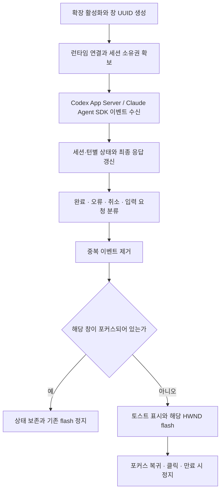

# Job-Finish 기능과 구현 알고리즘

작성일: 2026-10-03 · 갱신일: 2026-10-06

이 문서는 구현할 기능, 처리 알고리즘, Windows 창 선택·알림 규칙과 구현 완료 조건을 정의한다. 완료 감지는 Codex App Server 이벤트를 수신하고, Claude는 별도 Agent SDK adapter를 사용한다. 선택 근거·비용 비교·과거 구현과 실측 기록은 [일지](일지.md)에 보관한다.

## 구현할 기능

1. 포커스하지 않은 VS Code 창에서 Codex·Claude Code 작업이 완료되거나 한도·오류 등으로 중단되거나 질문에 대한 상호작용이 필요하면 toast 또는 flash로 알린다.
2. 여러 VS Code 창에서도 창 ID로 작업을 구분하고 해당 창을 보고 있지 않을 때 알린다.
3. 런타임 연결·이벤트 구독과 감지 상태를 유지한다. 수신한 이벤트로 상태와 결과를 갱신하고, 버퍼·대기 이벤트·결과 이력의 메모리와 불필요한 프로세스 실행을 제한한다.

## 전체 처리 구조



검증 코드와 제품 알림은 같은 런타임 adapter·상태 처리기를 사용한다. 완료 감지를 위해 세션 로그 파일을 감시하거나 CLI stdout을 파일로 저장한 뒤 다시 읽지 않는다. 소스 파일 수정, 프로세스 종료, 수신이 한동안 없다는 사실만으로 완료를 판정하지 않는다.

초기 실행 범위는 Windows의 로컬 VS Code Node.js Extension Host다. `onStartupFinished`로 활성화하고 런타임 연결·이벤트 구독·flash 타이머를 확장 생명주기에 연결한다. 원격 런타임과 로컬 Windows 알림을 함께 지원하려면 감지 측과 로컬 알림 측을 나누어야 한다. 브라우저 전용 VS Code는 이 구현 범위에 포함하지 않는다.

## 1. 포커스하지 않은 창의 작업 상태 알림

### 세션 연결과 신호 형식

연결은 확장이 직접 시작한 실행 또는 지원되는 연동으로 이벤트를 수신할 수 있는 런타임에 한정한다. 해당 런타임의 session/thread ID를 창 UUID에 명시적으로 바인딩한다. `cwd`나 전역 최신 세션만으로 원래 창을 추정하지 않는다.

기존 Codex·Claude 화면과의 연동은 실제 실행 런타임의 이벤트 연결 계약을 확인한 범위만 지원한다. 별도 App Server를 시작하거나 저장된 세션 ID를 선택하는 것만으로 다른 확장 프로세스의 이벤트를 자동 수신한다고 가정하지 않는다. 직접 실행 경로에서는 Job-Finish가 실행 시작·승인·입력·취소 처리도 담당한다.

`runtimeId`는 같은 실행 환경의 같은 런타임 연결 대상을 여러 창이 동일하게 식별하기 위한 값이다. 재연결마다 바뀌는 `connectionId`와 구분한다. Codex의 `sessionId`에는 App Server의 thread ID를 저장한다. Claude SDK 실행은 별도 adapter에서 같은 내부 상태 모델로 변환한다.

```typescript
type Provider = "codex" | "claude";
type NotificationStatus =
  | "idle" | "running" | "completed" | "error"
  | "cancelled" | "waitingForInput" | "unknown";

interface SessionBinding {
  windowInstanceId: string;
  provider: Provider;
  runtimeId: string;
  connectionId: string;
  sessionId: string;
  source: "ownedExecution" | "verifiedIntegration";
}
```

### Codex App Server 연결 순서

1. 직접 실행은 `codex app-server`의 stdio 연결을 사용한다. 메시지 수신기를 먼저 준비하고 연결별 초기화가 끝난 뒤 작업을 시작한다.
2. `initialize` 요청과 `initialized` 통지로 연결을 초기화한다.
3. 새 실행은 `thread/start`, 기존 실행 재개는 `thread/resume`을 사용하고 반환된 thread ID를 해당 창에 연결한다. 저장 이력 조회용 `thread/read`는 실시간 구독으로 취급하지 않는다.
4. `turn/start` 후 같은 thread의 이벤트를 계속 수신한다. 실행 중인 턴을 취소할 때에는 `turn/interrupt`를 요청하고 최종 상태를 확인한다.
5. `turn/completed`의 종료 상태를 공통 상태로 변환한 뒤 창별 알림 정책에 전달한다.

지원하는 설치 버전의 프로토콜 타입으로 요청·응답·서버 요청·통지를 구분한다. 각 메시지를 해당 연결의 요청 ID와 바인딩된 세션·턴에 대응시킨다.

### provider별 판정 규칙

| 입력 | 상태를 만드는 이벤트 | 본문과 식별 정보 |
| --- | --- | --- |
| Codex App Server | `turn/completed`, `turn.status: completed` → `completed` | thread ID·`turn.id`와 같은 턴의 최종 응답 |
| Codex App Server | `turn/completed`, `turn.status: failed` → `error` | thread ID·`turn.id`·오류 정보 |
| Codex App Server | `turn/completed`, `turn.status: interrupted` → `cancelled` | thread ID·`turn.id` |
| Claude Agent SDK | `type: result`, `subtype: success`, `is_error: false` → `completed` | `session_id`, `result`, 결과 ID와 실행 바인딩 |
| Claude Agent SDK | 실패·한도 도달 `result` → `error` | 결과 유형과 오류 본문 |
| 연결 단절·해석 불가 | 종료 상태를 확인할 수 없으면 `unknown` | 마지막 확인 세션·턴과 진단 |

Codex의 최종 응답은 같은 thread·turn에 속한 `item/completed`의 `agentMessage` 등 지원 버전에서 확인한 결과 이벤트로 보관한다. 본문만 수신한 상태에서 완료를 만들지 않는다. 상태 확정 전에 본문이 누락되어도 이전 턴의 응답을 대신 표시하지 않는다. 일반 오류 통지만으로 턴 종료를 확정하지 않으며, 확인된 실행 시작 실패는 해당 요청의 오류로 구분한다.

Claude는 SDK의 `result`를 판정하고 스트림의 뒤따르는 이벤트도 정리한다. 일반 assistant 응답을 전체 실행 완료로 바꾸지 않는다. 취소는 해당 실행의 명시적 취소 근거가 있을 때만 `cancelled`로 처리한다.

Codex는 런타임이 제공한 turn ID를 사용한다. Claude에 동등한 턴 ID가 없으면 실행 시작 때 만든 요청 ID와 SDK 결과 ID를 해당 실행에 바인딩한다. 단일 응답·턴 종료와 관련 백그라운드 작업 전체의 종료를 구분한다.

이벤트 처리 예시는 다음과 같다. 아래는 상태 처리 순서이며 전체 전송 스키마 예시는 아니다.

```text
thread T / turn U 시작 → running
같은 T/U의 최종 본문 수신 → 본문만 갱신
T/U의 turn/completed 수신 → completed / error / cancelled 분류
세션 소유권과 완료 키 확인 → 해당 창의 포커스·toast/flash 정책 적용
종료 확인 전 연결 단절 → unknown, 재연결 후 상태 대조
```

### 한도·오류·질문에 따른 상호작용

실패·취소 종료 상태와 SDK 오류 결과를 성공으로 바꾸지 않는다. `error_max_turns`는 실행 턴 수 제한이며 계정 사용량 제한과 동일한 사건으로 취급하지 않는다. 사용량 제한·API 오류의 세부 분류는 지원 버전의 이벤트와 오류 정보를 확인한 뒤 adapter에 추가한다.

질문·승인 감지는 provider가 제공하는 요청/응답 계약을 사용한다. 요청 ID·대상 실행·질문 본문과 미해결 상태를 확인해 `waitingForInput`으로 만들고, 답변·요청 해제·턴 종료에 따라 정리한다. 일반 도구 호출을 모두 입력 대기로 처리하지 않는다. 같은 요청의 재전달은 중복 알림으로 만들지 않으며, 사용자 답변은 원래 요청에 대응시킨다. 요청 중계 UI는 연결된 실행에 답변을 전달하고, provider별 이벤트 fixture로 상태 전이를 검증한다.

완료·입력 요청·사용량 제한·API 오류·취소 각각의 실제 런타임 이벤트를 확보하고 상태 분류를 검증해야 세 기능 전체의 완료 기준을 충족한다.

### 알림 판단

신호를 받은 창의 `vscode.window.state.focused`를 알림 직전에 확인한다. 이미 보고 있는 창이면 새 toast/flash를 시작하지 않고 해당 창의 실행 중인 flash를 정리한다. 다른 창이 포커스되어 있다는 사실은 이 창의 알림을 생략할 이유가 아니다.

```text
신호 수신
  연결한 세션의 신호인가? 아니면 무시
  이미 처리한 이벤트인가? 맞으면 무시
  상태·본문·세션·창 ID를 제한된 결과 저장소에 기록
  해당 창이 focused인가? 맞으면 해당 flash 정지 후 종료
  toast 설정이 켜졌으면 provider·상태·본문·창 ID로 표시
  flash 설정이 켜졌고 HWND가 확인되면 그 HWND에만 시작
```

알림 본문은 에이전트의 최종 응답을 사용하고 요약을 위한 AI 호출은 추가하지 않는다. Windows 토스트 본문은 최대 180자로 제한한다. 전체 본문은 제한된 결과 저장소나 런타임의 지원되는 조회 API로 열고, 잘린 결과나 조회 불가 상태를 표시한다.

### Windows 토스트 구현

VS Code의 포커스 통지는 Windows의 실제 전경 HWND 전환보다 먼저 도착할 수 있다. HWND 관측은 통지 후 400ms(초기 활성화 750ms)를 기다린 뒤 시작하고, 동일 HWND·PID와 해당 창의 focused 상태가 추가 150ms 유지된 경우 바인딩한다. 대기 중 포커스가 바뀌거나 확장이 종료되면 해당 관측을 폐기한다. 이는 창 식별 단계이며 전경 전환 재시도가 아니다.

Windows 시스템 토스트는 로컬 Node.js의 native 알림 adapter로 전송한다. TypeScript 호출 계층과 native 알림 전송 계층을 분리한다.

구체적인 구현 선택지는 `node-notifier`의 `WindowsToaster`가 포함하는 SnoreToast 실행 파일을 사용하는 것이다. 이 경우 TypeScript 코드는 알림 호출을 제어하고 라이브러리가 Windows native 전송을 담당한다. VSIX에는 필요한 실행 파일을 포함한다. 외부 상주 서비스를 필수로 만들지 않고 알림 요청에 필요한 동안만 실행한다.

토스트 adapter는 다음 입력을 받도록 구성한다.

```typescript
interface ToastRequest {
  notificationId: string;
  windowInstanceId: string;
  title: string;
  message: string;
  appId: string;
  onClick?: () => void;
}
```

앱 ID 등록과 전송 ID를 일치시킨다. WinRT adapter를 사용하면 시작 메뉴 바로가기의 AppUserModelID 설정과 토스트 활성화를 구현하고, SnoreToast adapter를 사용하면 제공되는 등록·전송 기능을 호출한다. SnoreToast의 native pipe는 `action=clicked`를 사용한다. 토스트 클릭 callback은 해당 `notificationId`의 flash를 정지하고, HWND·PID·실행 파일을 재검증한 해당 창을 활성화한다. 최소화된 창만 복원하며 최대화 상태는 유지한다. 창 연결이 없거나 Windows가 전경 전환을 거부하면 진단을 기록한다. 알림 센터에서 나중에 클릭하거나 확장이 종료된 상황까지 지원하려면 별도 활성화 경로를 구성한다.

## 2. 여러 창의 식별과 해당 HWND만 flash

### 창 UUID, 세션, 소유권

`activate()`마다 `crypto.randomUUID()`로 창 실행 ID를 생성한다. 같은 workspace의 여러 창에서도 UUID를 공유하지 않는다. `vscode.env.sessionId`, workspace URI, Extension Host PID는 진단 정보로 기록한다. 재시작·확장 재활성화 후에는 새 UUID를 만든다.

각 이벤트 adapter는 `provider`, `runtimeId`, `sessionId`와 창 UUID의 바인딩을 참조한다. 연결 세대별 `connectionId`를 검사해 이전 연결에서 뒤늦게 온 이벤트를 배제하고, 현재 소유 창에서만 알림을 처리한다. 다른 창으로 전달하는 중앙 라우터를 필수로 만들지 않는다.

같은 host/profile의 `globalStorageUri/owners`에서 `provider + runtimeId + sessionId`별 소유권을 조정한다. 이 값의 명확한 직렬화 결과를 SHA-256으로 해시해 lock 이름으로 사용한다. `open(lockPath, "wx")`가 성공한 소유자 하나만 알린다. lock에는 임의 token과 UUID·런타임·세션 식별자를 기록하고 정상 해제 시 token이 일치할 때만 삭제한다. provider의 ID에는 파일 경로용 소문자 변환을 적용하지 않는다.

이 배타성은 공통 조정 저장소와 같은 런타임 식별 규칙을 사용하는 창들에 적용한다. 같은 런타임에 창마다 서로 다른 `runtimeId`를 발급해 중복 소유하는 구성을 허용하지 않는다. 재연결 시에는 같은 식별자를 유지하고, 다른 런타임에서 같은 저장 thread를 재개하는 경우에도 동일 실행의 소유권을 먼저 확인한다. 이 관계를 확인할 수 없으면 동시 연결을 거부한다.

비정상 종료 후 소유권을 회수할 때 살아 있는 소유자를 확인하고 token을 검사한다. 소유권 이전은 이전 소유자의 처리를 중지한 뒤 진행하며, 알림 직전에도 소유권이 유효한지 확인한다.

중복 제거는 런타임·세션별로 수행한다.

| 이벤트 | 중복 키 |
| --- | --- |
| Codex 종료 | provider·runtime ID·thread ID·turn ID의 조합; 종료 상태는 같은 키의 값으로 관리 |
| Claude SDK 결과 | provider·runtime ID·session ID·실행 요청 ID와 검증된 결과 ID |
| 질문·승인 | provider·runtime ID·session ID·서버 요청 ID; 요청 ID가 연결 범위라면 connection ID도 포함 |

Codex의 같은 턴 종료가 재전달되면 다시 알리지 않는다. 동일 키에 상충하는 종료 상태가 오면 진단·재조회하고 두 번 완료 알림을 만들지 않는다. 연결 재수립은 완료 키를 바꾸지 않는다. 질문 ID의 유효 범위와 재연결 후 미해결 요청 복구는 provider 계약으로 확인한다.

최초 연결의 과거 이력은 알림 기준점 설정에만 사용한다. 재시작 복구에서는 처리한 종료 키와 기준점을 복원하고 런타임 상태를 대조한다. 감시 중 끊긴 턴은 복구로 종료가 확인됐을 때만 한 번 알리며, 종료를 확인하지 못하면 `unknown`으로 남긴다.

### UUID와 Windows HWND의 연결

UUID는 확장 실행 식별자이고 HWND는 Windows의 실제 창 핸들이다. 둘을 같은 값으로 쓰지 않는다. Windows flash adapter에는 선택한 HWND를 별도로 제공한다.

연결 정보는 `windowInstanceId`, `hwnd`, native 창 PID, 확인 방식·시각을 포함한다. 실행 직전 `IsWindow(hwnd)`와 대상 프로세스를 다시 확인하고 창이 사라지거나 재활성화되면 연결을 버린다. 여러 창이 같은 Code PID를 공유할 수 있으므로 PID 단독으로 창을 결정하지 않는다.

같은 프로젝트·같은 제목의 창도 UUID와 HWND를 각각 연결한다. 제목 점수 동률의 ZOrder를 소유권으로 사용하지 않는다. HWND가 모호하면 미연결 상태로 남겨 토스트에 창 UUID를 표시하고 flash는 시작하지 않는다.

해당 창이 포커스될 때 `onDidChangeWindowState`와 native 전경 HWND를 함께 관측해 UUID 연결 후보를 확보하거나 명시적인 연결 명령을 제공한다. 관측 중 포커스가 바뀌거나 후보를 확정할 수 없으면 연결을 보류한다. 같은 폴더의 두 창과 빠른 포커스 전환에서도 다른 창의 HWND를 확정하지 않도록 처리한다.

### TypeScript에서 호출할 Windows 함수

Windows native 호출은 예를 들어 Koffi 같은 Node.js FFI 모듈로 `user32.dll`을 로드해 수행한다. 이는 TypeScript로 호출을 작성하는 방식이며 native 의존성은 VSIX에 포함한다. Electron main process의 `BrowserWindow`나 HWND 접근이 일반 VS Code 확장 API로 제공된다고 가정하지 않는다.

| Win32 함수 | 역할 |
| --- | --- |
| `EnumWindows(callback, lParam)` | 최상위 창 열거 |
| `IsWindowVisible(hwnd)` | 보이는 후보만 선택 |
| `GetWindowTextW(hwnd, buffer, count)` | UTF-16 창 제목 읽기 |
| `GetWindowThreadProcessId(hwnd, out pid)` | HWND의 프로세스 PID |
| `IsWindow(hwnd)` | 핸들의 유효성 확인 |
| `GetForegroundWindow()` | 현재 전경 HWND |
| `FlashWindow(hwnd, invert)` | 특정 창 flash 상태 변경 |
| `FlashWindowEx(FLASHWINFO*)` | 시작·정지와 깜빡임 정책 |

`HWND`는 pointer 크기를 유지해 표현하고 임의의 32bit 정수로 잘라내지 않는다. Win32 `BOOL`은 32bit 정수, `UINT`·`DWORD`는 unsigned 32bit다. 32bit 플랫폼에서는 함수 호출 규약도 맞춰 선언한다. callback을 사용하는 `EnumWindows`는 native 호출이 끝날 때까지 callback 수명을 유지한다.

`FLASHWINFO` 레이아웃은 다음과 같다.

```c
typedef struct {
  UINT  cbSize;
  HWND  hwnd;
  DWORD dwFlags;
  UINT  uCount;
  DWORD dwTimeout;
} FLASHWINFO;
```

`cbSize`는 native struct의 실제 크기다. pointer 정렬을 반영하면 Windows x64에서는 32byte, x86에서는 20byte다. 하드코딩보다 FFI struct size 기능으로 구한다.

| flag | 값 |
| --- | ---: |
| `FLASHW_STOP` | 0 |
| `FLASHW_CAPTION` | 1 |
| `FLASHW_TRAY` | 2 |
| `FLASHW_ALL` | 3 |
| `FLASHW_TIMER` | 4 |
| `FLASHW_TIMERNOFG` | 12 |

`FlashWindowEx` 반환값은 호출 전 창의 활성 상태이며 단순한 성공 bool로 취급하지 않는다. 실제 시각 효과와 대상 HWND·포커스 전환을 함께 확인한다.

### flash 수명과 정지

선택한 HWND에만 flash 상태를 둔다. 같은 창에 새 알림이 오면 기존 타이머를 먼저 정리하고 최신 활성 알림을 관리한다. 알림별 `notificationId`를 창 UUID와 구분한다.

manual flash는 알림 발생 후에만 500ms interval 타이머를 만든다. `FlashWindow(hwnd, true)`로 시작하고 다음 tick 전에 HWND 유효성, 해당 창 포커스 복귀, 알림 정지 요청, 만료를 확인한다.

```text
startFlash(hwnd, notificationId, timeout)
  기존 같은 HWND flash가 있으면 정지
  HWND와 전경 상태 재확인
  FlashWindow(hwnd, true)
  500ms 간격의 타이머 등록
    HWND가 없어졌거나 해당 HWND가 전경이거나 클릭/정지 요청이거나 만료면 stop
    아니면 FlashWindow(hwnd, true)

stopFlash(hwnd)
  해당 타이머 해제
  유효한 HWND면 FlashWindow(hwnd, false)
  FlashWindowEx({ cbSize, hwnd, dwFlags: 0, uCount: 0, dwTimeout: 0 })
  해당 알림·타이머 상태 제거
```

OS 자체 반복을 사용할 때는 `FLASHW_TRAY | FLASHW_TIMERNOFG`를 적용한다. 같은 HWND에 manual timer와 OS 반복을 동시에 시작하지 않는다.

flash 수명은 확장 내부 타이머로 관리한다. 기본 만료값은 5분으로 두고 포커스 복귀 시 즉시 종료한다. timeout을 무제한으로 제공할 때도 명시적 정지와 확장 종료 정리를 유지한다.

## 3. 런타임 이벤트 연결의 상주와 메모리 최소화

### 이벤트 수신과 연결 복구

Codex adapter는 App Server 메시지를 직접 받고, Claude adapter는 SDK 스트림을 처리한다. 세션 로그 경로·파일 offset·inode·truncate 복구는 제품 감지 경로에 사용하지 않는다.

App Server stdio는 줄로 구분된 JSON 메시지이므로 UTF-8 문자와 메시지가 수신 chunk 경계에서 분리되는 경우를 처리한다. 요청 응답은 요청 ID에 대응시키고, 이벤트 상태 갱신은 세션·턴별로 직렬화한다. 수신 오류·지원하지 않는 메시지·누락된 식별자는 진단한다.

1. 이벤트 처리기를 준비하고 연결을 초기화한다. 세션 소유권과 최초 기준점 설정이 끝난 뒤 새 작업을 시작한다. 초기화 중 수신한 이벤트도 제한된 queue에 보관해 기준점과 대조한다.
2. 바인딩된 세션·턴만 갱신한다. 본문 delta·항목 종료·전체 턴 종료를 구분하고 이전 턴의 본문을 섞지 않는다.
3. 종료 상태가 확인되면 완료 키와 결과를 기록하고 포커스·toast/flash 정책에 전달한다.
4. EOF·연결 오류만 발생하면 진행 중인 턴을 성공이나 취소로 추정하지 않는다. 미확인 상태를 보존하고 연결 오류를 진단한다.
5. 재연결 시 요청 대기열·미완성 전송 버퍼를 정리하고 새 connection ID를 부여한다. 런타임·세션 바인딩과 처리 기준점은 유지한다.
6. 지원되는 상태 조회와 이벤트 연결 복구 절차로 끊긴 턴의 최종 상태를 대조한다. 새 턴 시작 요청을 자동 재전송해 같은 작업을 중복 실행하지 않는다.
7. 상태를 확정할 수 없으면 `unknown`을 유지한다. 과거 완료 재생과 감시 중 끊긴 턴의 복구 알림을 구분한다.

Codex에서는 `optOutNotificationMethods`로 사용하지 않는 통지를 억제한다. 종료 판정·결과 본문·승인·입력·복구에 필요한 이벤트는 유지한다.

### 메모리와 프로세스 수명

연결 가능한 기존 런타임의 이벤트를 이용하고 불필요한 중복 실행을 피한다. 직접 실행 방식에서는 App Server 또는 SDK 런타임 프로세스가 실행·연결 동안 존재할 수 있다. 감지부는 연결·전송 decoder·미완성 메시지·세션별 상태·제한된 결과와 중복 키를 유지한다.

버퍼와 결과 저장 상한의 초기 설정값은 다음과 같다. 제품 부하 검증에 따라 조정한다.

| 항목 | 기본 상한·정리 규칙 |
| --- | --- |
| 미완성 수신 메시지 | 연결별 1 MiB; 초과 시 진단하고 연결 복구로 전환, 종료를 누락한 채 정상 처리하지 않음 |
| 대기 이벤트 | 연결별 512건 및 합계 4 MiB; 초과 시 명시적 오류·복구 처리, 제어 이벤트를 조용히 버리지 않음 |
| 최근 결과 본문 | 창별 최대 20건, 건당 16 KiB; 원문은 지원되는 조회 API로 확인하고 잘림 여부 표시 |
| 진단 오류 | 최근 100건 |
| 중복 키 | 세션별 최근 512개; 복구 중인 턴의 키는 복구 완료까지 유지 |
| flash 타이머 | 창별 최대 1개; 포커스 복귀·만료·해제 시 삭제 |

연결·세션 수에도 설정 가능한 상한을 두고, 세션별 상한을 지켜도 전체 메모리가 무제한으로 늘지 않게 한다. 중복 키를 제한하면 오래된 키가 다시 등장할 때 재알림될 수 있으므로 처리 기준점과 재전달 범위를 함께 정한다. 구현 상한을 `exactly once`의 무제한 보장으로 표현하지 않는다.

장시간 이벤트 수신·많은 세션·큰 미완성 메시지·연결 반복 시나리오에서 heap과 프로세스 증가를 측정한다. 종료한 세션의 상태·queue·요청 대기·타이머를 해제한다.

감시 해제 시 해당 세션의 이벤트 구독·요청 대기·처리 queue를 정리하고 자기 token의 소유권을 해제한다. 확장 비활성화 시 연결과 모든 flash 타이머를 정리한다. 종료할 수 있는 프로세스는 자신이 시작하고 소유한 런타임에 한정하고, 연동한 기존 확장의 프로세스는 종료하지 않는다.

## 4. 구현 구성

| 구성요소 | 책임 |
| --- | --- |
| 런타임 연결 관리 | App Server 전송 수신·초기화·요청 응답·재연결 |
| provider adapter·상태 처리기 | Codex App Server·Claude SDK 이벤트를 세션·턴별 공통 상태로 변환 |
| 실행 제어 | 소유한 런타임의 실행·입력·승인·취소·정리 |
| 세션 소유권 관리 | 런타임·세션 소유권·완료 키·처리 기준점 |
| 확장 생명주기 | 창 ID 생성·런타임 바인딩·이벤트 구독·종료 정리 |
| Windows 알림 adapter | UUID와 HWND 연결·포커스 확인·토스트 전송·flash 제어 |

## 5. 구현 완료 조건

### 단위·연결 검증

| 입력·조건 | 완료 기준 |
| --- | --- |
| 같은 턴의 본문 뒤 정상·실패·취소 종료 이벤트 | 각각 `completed`·`error`·`cancelled`; 본문만으로는 완료하지 않음 |
| 여러 세션·턴의 이벤트 교차 수신 | 종료 상태·본문·창 UUID가 섞이지 않음 |
| 같은 종료 이벤트 반복, 재연결 후 재전달 | 같은 턴의 완료 알림은 한 번; 충돌 상태는 진단·재조회 |
| UTF-8·JSON 메시지 분할, 여러 메시지 동시 수신 | 경계에 관계없이 같은 요청·이벤트로 해석 |
| 종료 전 EOF·프로세스 오류·메시지 손상 | 성공으로 처리하지 않고 연결 상태 진단·복구 |
| 승인·질문·답변·요청 해제·취소 | 요청 ID와 실행을 연결하고 `waitingForInput`을 올바르게 해제 |
| 연결 단절 후 상태 조회·구독 복구 | 확인된 종료만 반영; 새 실행 중복 생성과 과거 완료 재알림 없음 |
| 새 창·Reload Window·Extension Host 재시작 | 새 UUID, 기존 처리 기준점 복원, 소유권 재확인 |
| 대형 메시지·이벤트 적체·세션 증가·연결 반복 | 설정한 상한과 종료 정리 동작 확인; 초과·누락을 진단 |

### 실제 창·알림 검증

1. 같은 프로필의 실제 VS Code 창 A/B에서 다른 프로젝트와 같은 프로젝트를 각각 검사한다. 각 창에 이벤트를 수신할 수 있는 다른 세션을 연결한다.
2. 같은 런타임·세션을 두 창이 동시에 연결하면 한 창만 소유권을 얻는지 확인한다. 다른 connection ID나 재연결로 이 제한을 우회하지 않아야 한다.
3. 실제 실행에서 정상·실패·취소를 재현한다. A의 최종 본문·상태는 A에만 표시되고 B의 결과와 섞이지 않아야 한다.
4. B를 보고 있을 때 A가 종료되면 A의 toast/flash만 시작한다. A를 보고 있을 때에는 생략하고, A로 돌아오거나 해당 알림을 클릭하면 flash를 정지한다.
5. 같은 프로젝트·같은 제목의 두 창과 빠른 포커스 전환에서도 UUID·HWND 연결을 검사한다. HWND가 모호하면 잘못된 창을 flash하지 않는다.
6. 승인·사용자 질문·사용량 제한·API 오류를 실제 런타임에서 재현하고 성공 완료와 구분한다.
7. 연결 단절·재연결·창 재로드·비정상 종료 후 복구를 검사하고, 이전 소유자와 새 소유자가 중복 알리지 않는지 확인한다.
8. 감시부 heap·전체 프로세스 사용량을 구분해 메모리 상한과 자원 해제를 측정한다.

