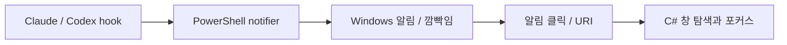
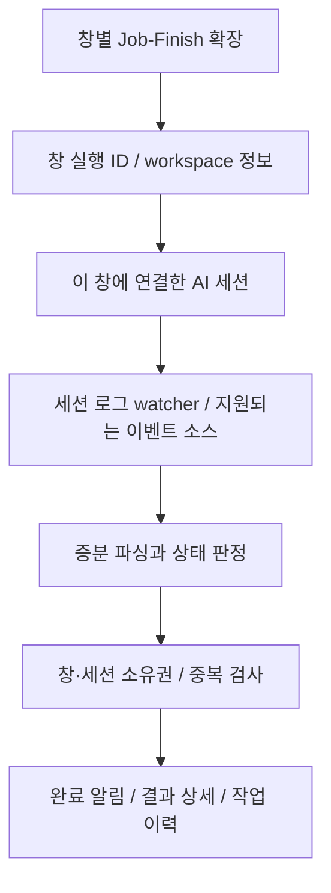

# Job-Finish: VS Code 내부 TypeScript 감시 확장으로 전면 교체

작성일: 2026-10-02 · 조사 대상: 현재 저장소와 공식 확장 API 문서

이 문서는 기존 구현을 조사한 결과와 교체 설계다. 확장 구현, 실제 여러 창에서의 재현 테스트, 에이전트 로그 형식별 완료 판정 검증은 아직 수행하지 않았다.

## 1. 검토 결과

**C# 실행 파일과 Job-Finish hook을 제거하고, VS Code 확장이 TypeScript로 상주 감시하면서 해당 창에 작업 결과를 표시하는 구조로 교체할 수 있다.**

다만 구현 가능성을 다음과 같이 나누어야 한다.

| 요구사항 | 검토 결과 |
| --- | --- |
| VS Code 안에서 감시 프로그램 상주 | 가능. 확장이 활성화된 동안 이벤트 구독과 watcher를 유지한다. |
| 여러 VS Code 창에서 각각 감시·알림 | 가능. 각 창의 확장 실행 컨텍스트에서 처리한다. |
| 현재 창의 프로젝트·터미널·포커스 확인 | 공개 API로 가능하다. |
| 같은 프로젝트를 여러 창에서 구분 | 가능. Job-Finish가 실행별 UUID를 만들고 세션을 연결해야 한다. |
| VS Code 자체의 “첫 번째/두 번째 창” 번호 조회 | 조사한 공개 API에는 없다. 자체 표시 번호는 만들 수 있다. |
| 기존 Claude/Codex 확장의 모든 작업 완료를 자동 구독 | 공개 연동 계약을 확인하지 못했다. 로그 감시만으로 완전 지원을 확정할 수 없다. |
| C# 없이 기존 Windows 알림·창 강제 포커스·작업표시줄 깜빡임 유지 | VS Code의 일반 확장 API만으로 기존 동작을 모두 보장할 수 없다. 새 버전은 VS Code 내부 알림을 기준으로 설계한다. |

확장은 Extension Host에서 실행되며, 로컬·원격 실행 위치를 선언할 수 있다. 따라서 별도 Windows 상주 서비스 대신 확장 생명주기에 감시 기능을 붙이는 방향이 적합하다. [VS Code Extension Host](https://code.visualstudio.com/api/advanced-topics/extension-host)

가장 먼저 해결할 문제는 **완료 신호의 신뢰성**과 **AI 세션이 속한 창의 식별**이다. watcher가 어떤 파일이 바뀌었는지 아는 것과, 어떤 창에서 시작한 작업이 끝났는지 아는 것은 별개다.

## 2. 현재 구조와 교체 대상

현재 프로젝트는 이미 설치 CLI를 TypeScript로 작성했지만, 실제 알림과 창 처리는 PowerShell 및 C#에 의존한다.



| 현재 파일 | 확인한 책임 | 새 구조에서의 처리 |
| --- | --- | --- |
| [`src/cli/installers/claude.ts`](../src/cli/installers/claude.ts) | `Stop`, `PreToolUse/AskUserQuestion` hook 설치 | 신규 hook 설치 제거 |
| [`src/cli/installers/codex.ts`](../src/cli/installers/codex.ts) | `hooks.Stop` 설치와 기존 `notify` 이관 | 신규 hook 설치 제거 |
| [`templates/notify.win.ps1`](../templates/notify.win.ps1) | 메시지 추출, 오류 분류, 세션 탐색, 중복 억제, Windows 알림 및 창 처리 | TypeScript 감시·상태·UI 모듈로 대체 |
| [`tools/win-focus/Windows/WindowEnumeration.cs`](../tools/win-focus/Windows/WindowEnumeration.cs) | 창 열거와 제목·cwd·PID에 따른 점수 계산 | 해당 창 내부에서 실행하므로 제거 |
| [`tools/win-focus/Windows/WindowTargeting.cs`](../tools/win-focus/Windows/WindowTargeting.cs) | 명시 HWND와 점수 기반 대상 선택 | 창별 세션 소유권으로 대체 |
| [`scripts/build-focus-exe.mjs`](../scripts/build-focus-exe.mjs) | .NET Windows 실행 파일 빌드 | VSIX 빌드로 대체 |
| [`package.json`](../package.json), [`tsup.config.ts`](../tsup.config.ts) | npm CLI 배포, Windows 제한, CLI 진입점 | VS Code 확장 manifest와 확장 진입점으로 변경 |

현재 C#은 폴더명·제목 일치와 Z 순서를 이용해 창을 선택한다. 같은 폴더를 여러 창에 열거나 제목을 바꾸면 그 정보만으로 정확한 창을 구분하기 어렵다. PowerShell에는 전역 Codex 로그를 최신순으로 찾는 호환 경로도 있다. 새 구조는 명시적으로 연결한 세션의 이벤트만 처리하여 이런 추정을 줄인다.

이 분석은 소스에서 확인한 구조적 한계다. 현재 사용자가 겪는 개별 오류를 재현하거나 원인을 확정한 것은 아니다.

## 3. 목표 구조

**기존 Claude/Codex 사용 화면을 유지하고, Job-Finish는 VS Code 확장 안에서 감시와 결과 표시를 담당한다.** 자체 AI 채팅 화면을 새로 만드는 것은 기본 교체 범위에 포함하지 않는다.



확장은 `onStartupFinished`로 자동 활성화하고, 초기화 중 완료된 과거 작업을 다시 알리지 않도록 먼저 기준점을 잡는다. watcher·구독·타이머는 `Disposable`로 정리한다. VS Code 창이 닫히거나 확장이 중지되면 감시도 중지된다. 종료 후에도 살아 있는 에이전트를 계속 감시하는 기능은 이 구조의 기본 범위에 포함되지 않는다. [Activation Events](https://code.visualstudio.com/api/references/activation-events#onstartupfinished)

### 감시 대상

소스 파일 전체의 변경을 작업 완료 신호로 사용하지 않는다. 읽기·분석만 수행한 작업은 파일을 수정하지 않을 수 있고, 빌드나 포맷터도 파일을 변경하기 때문이다.

대신 연결한 AI 세션의 로그 또는 구조화된 이벤트를 감시한다. `createFileSystemWatcher`는 변경 감지에 사용하고, 로그 파서는 추가된 기록을 읽어 작업 상태를 해석한다. watcher는 알림 트리거일 뿐 완료 판정기가 아니다. [VS Code FileSystemWatcher](https://code.visualstudio.com/api/references/vscode-api#workspace.createFileSystemWatcher)

## 4. hook 없이 AI 작업 완료를 얻는 방법

### 4.1 기존 Claude/Codex 세션 로그 감시: 기본 도입 경로

기존 확장·터미널 사용 방식을 유지하려면 세션 로그를 읽는 adapter가 가장 가까운 접근이다.

| 대상 | 조사에서 확인한 정보 | 구현 전에 확인할 정보 |
| --- | --- | --- |
| Claude Code | 현재 notifier가 hook의 `transcript_path`에서 assistant 메시지와 도구·서브에이전트 기록을 읽는다. | hook 없이 세션 파일을 발견하는 방법, 설치 버전별 저장 위치, 완료·입력 대기·오류를 확정할 기록 |
| Codex | 현재 notifier가 `~/.codex/sessions`의 JSONL과 thread ID를 이용하고, `final_answer`를 우선해 본문을 추출한다. | 실제 세션 저장 위치 설정, 턴 종료 기록, 상태 및 ID의 연결, IDE·CLI별 차이 |

`~/.claude/projects`와 `~/.codex/sessions`는 탐색 후보로 두고, 실제 환경의 설정·로그와 대조한다. 사용자 지정 저장 위치와 원격 홈 디렉터리를 처리해야 한다. 경로와 내부 JSONL 필드가 안정적인 공개 연동 계약이라고 가정하지 않는다.

특히 **SDK의 `result` 이벤트와 디스크 transcript 기록은 동일한 형식이라고 가정하면 안 된다.** 현재 hook이 제공하던 `transcript_path`, session ID, 실행 환경 정보를 없애므로, 세션 발견과 연결 과정을 새로 구현해야 한다.

로그 adapter는 지원하는 에이전트 버전과 원본 기록 형식을 명시한다. 다음 조건을 통과한 형식에만 자동 완료 알림을 활성화한다.

1. 현재 사용자 요청에 해당하는 턴/실행 ID를 식별할 수 있다.
2. 성공 종료와 오류·취소·입력 대기를 구분할 근거가 있다.
3. 중간 assistant 응답과 최종 결과를 구분할 수 있다.
4. 관련 백그라운드 작업이 남았는지 확인할 수 있거나, 알림 범위를 “응답 완료”로 명확하게 제한한다.

최종 메시지나 일정 시간의 파일 무변경만 확인한 경우에는 상태를 `unknown` 또는 “최종 응답 감지”로 표시한다. 확인되지 않은 완료를 성공으로 알리지 않는다. 지원 형식이 변경되면 감시 진단에 표시하고 자동 완료 판정을 중지한다.

### 4.2 공식 런타임 이벤트: 확장이 실행을 소유하는 경우

확장이 AI 실행을 직접 시작하고 이벤트 스트림을 받으면 완료와 창 소유권을 더 명확하게 관리할 수 있다.

| 대상 | 공식 신호 | 적용 조건 |
| --- | --- | --- |
| Codex App Server | `turn/completed`와 `turn.status` | Job-Finish가 연결한 런타임에서 해당 턴의 이벤트를 수신해야 한다. `completed`, `failed`, `interrupted`를 구분한다. |
| Claude Agent SDK | `message.type === "result"`와 `subtype` | Job-Finish가 시작한 SDK 실행에 적용한다. 정상 결과, 한도 도달, 실패를 구분하고 마지막 스트림 기록도 처리한다. |

각 신호는 공식 문서로 확인했다. [OpenAI Docs: Codex App Server](https://learn.chatgpt.com/docs/app-server), [Claude Agent SDK 실행 루프](https://code.claude.com/docs/en/agent-sdk/agent-loop#message-types)

이 방법은 Job-Finish hook을 요구하지 않지만, 확장이 에이전트 실행과 권한·입력 처리를 담당하게 된다. 에이전트 프로세스 자체는 존재할 수 있으며 감시 로직과 UI가 TypeScript 확장에 들어가는 구조다.

**별도 App Server나 SDK를 실행했다고 해서 기존 공식 VS Code 확장이 실행 중인 세션의 이벤트를 자동으로 받는 것은 아니다.** OpenAI 문서의 `thread/read`도 저장된 대화를 읽는 기능이며 이벤트 구독과 구별된다. 기존 런타임에 대한 연동 계약을 확인하기 전에는 이 방식으로 기존 확장을 수동 감시할 수 있다고 약속하지 않는다. [OpenAI Docs: thread/read](https://learn.chatgpt.com/docs/app-server#read-a-stored-thread-without-resuming)

따라서 기본 교체는 로그 감시 adapter로 시작한다. 지원 버전에서 신뢰할 완료 기록을 얻을 수 없다면 그 한계를 그대로 표시하고, 직접 실행하는 방식은 별도 기능으로 설계한다.

### 4.3 터미널 명령 종료 감시의 적용 범위

VS Code의 shell integration은 명령 시작·종료를 제공하지만, 대화형 `claude`나 `codex` 프로세스는 응답을 끝내도 다음 입력을 기다리며 계속 살아 있을 수 있다. **프로세스 종료와 AI 응답 완료를 구분해야 한다.** shell integration 사용 가능 여부도 셸과 설정에 따라 달라진다. [Terminal Shell Integration](https://code.visualstudio.com/docs/terminal/shell-integration)

`TerminalShellExecution.read()`는 실행 중 출력 스트림을 제공하지만, 구독하기 전의 전체 출력이나 모든 터미널의 과거 화면을 가져오는 API는 아니다. TUI 문자열을 파싱하여 완료를 판단하는 방식을 기본으로 삼지 않는다. [Microsoft 공개 API 선언](https://github.com/microsoft/vscode/blob/main/src/vscode-dts/vscode.d.ts)

빌드·테스트 같은 일반 VS Code Task의 종료 알림은 `tasks.onDidEndTaskProcess`로 별도 지원할 수 있다. 이는 AI 대화 턴 감시와 구분한다. [VS Code Tasks API](https://code.visualstudio.com/api/references/vscode-api#tasks.onDidEndTaskProcess)

## 5. 여러 VS Code 창에서의 식별과 동작

### 5.1 창 안에서 알 수 있는 것

현재 창의 `workspaceFolders`, `workspaceFile`, 터미널 목록, `window.state.focused`를 이용할 수 있다. 포커스 변화는 `onDidChangeWindowState`로 구독한다. 이 정보는 현재 창의 컨텍스트에 해당한다. [VS Code API](https://code.visualstudio.com/api/references/vscode-api)

“VS Code 몇 번째 창인가”를 반환하거나 다른 모든 창을 열거하는 공개 API는 조사에서 찾지 못했다. `env.sessionId`는 실행 순번이 아니며, `machineId`는 컴퓨터 식별자다. `process.pid`와 `VSCODE_PID`도 UI 창을 구분하는 영구 식별자로 사용하지 않는다. [Microsoft 공개 API 선언](https://github.com/microsoft/vscode/blob/main/src/vscode-dts/vscode.d.ts)

또한 한 창에 로컬·원격 등 여러 Extension Host가 있을 수 있으므로, **창 하나가 반드시 프로세스 하나에 대응한다고 설계하면 안 된다.** Job-Finish는 한 가지 실행 위치를 선택하고 그 활성화에 ID를 부여한다. [VS Code Extension Host](https://code.visualstudio.com/api/advanced-topics/extension-host)

### 5.2 자체 실행 ID

확장이 활성화될 때 `crypto.randomUUID()`로 `windowInstanceId`를 생성한다. 이는 운영체제의 창 ID가 아니라 **그 창에서 활성화된 Job-Finish 실행의 ID**다. 재시작·Reload Window·Extension Host 재시작 후에는 새 ID가 된다.

```ts
interface WindowIdentity {
  windowInstanceId: string;
  workspaceUris: string[];
  workspaceFileUri?: string;
  remoteName?: string;
  startedAt: string;
}

interface SessionBinding {
  windowInstanceId: string;
  provider: "claude" | "codex";
  sessionId: string;
  logUri: string;
  bindingSource: "userSelection" | "ownedExecution" | "verifiedIntegration";
}
```

UUID는 메모리에 유지한다. 동일 workspace를 여러 창에서 열 수 있으므로, workspace에 저장한 ID를 창의 유일한 ID로 재사용하지 않는다. `workspaceState`는 workspace 단위 저장소다. [Common Capabilities: Data Storage](https://code.visualstudio.com/api/extension-capabilities/common-capabilities#data-storage)

사용자 화면에는 `Job-Finish · Job-Finish 프로젝트 · a17c`처럼 프로젝트와 짧은 ID를 표시할 수 있다. 전체 UUID로 동작을 구분하고 짧은 문자열은 표시용으로만 사용한다.

### 5.3 세션과 창을 연결하는 규칙

**창별 UUID만으로 전역 로그의 원래 실행 창을 알아낼 수는 없다.** 예를 들어 두 창이 모두 `C:\work\app`을 열었고 로그에 `cwd`만 있다면 어느 창이 실행했는지 확정할 수 없다. 외부 터미널이나 데스크톱 앱도 같은 폴더의 로그를 만들 수 있다.

연결은 다음 순서로 처리한다.

1. 확장이 직접 시작한 실행: 시작 시 받은 session/thread ID를 현재 창에 연결한다.
2. 공식적으로 지원되는 연동: 세션과 창의 관계를 확인할 수 있는 정보가 있을 때 자동 연결한다.
3. 기존 세션 로그: `Job-Finish: 세션 연결`에서 사용자가 세션을 선택한다. 폴더 경로는 후보 필터로 사용한다.

프로젝트 경로나 최신 파일이라는 이유만으로 세션을 자동 소유하지 않는다. 사용자가 선택하여 연결한 세션의 완료만 그 창에서 처리한다. 이렇게 하면 같은 프로젝트의 여러 창도 각각 다른 세션을 감시할 수 있다.

동일 세션을 여러 창이 동시에 선택하면 기본적으로 알림 소유자는 한 창으로 제한한다. 다른 창으로 이동하는 동작은 명시적인 소유권 이전으로 처리한다. 재로드 후에는 세션 후보를 복원하되, 이전 소유권과 UUID를 그대로 유효하다고 간주하지 않는다.

### 5.4 표시 번호와 창 간 조정

`창 1 / 창 2` 표시는 필요할 때 별도 구현한다. 같은 실행 환경과 저장 영역에 있는 **Job-Finish가 활성화된 창들**이 등록 파일을 공유하면 등록 시각 순으로 표시할 수 있다. 이는 VS Code 자체의 창 생성 순서가 아니고, 확장이 비활성인 창은 목록에 들어가지 않는다.

등록 영역은 같은 host/profile의 `globalStorageUri` 아래에 둔다. 창별 등록 파일과 heartbeat로 활성 상태를 확인하고, 종료·비정상 종료 후 만료된 등록을 정리한다. 번호는 표시용이며 이벤트 라우팅은 UUID로 한다. [Common Capabilities: Data Storage](https://code.visualstudio.com/api/extension-capabilities/common-capabilities#data-storage)

세션별 소유권은 단순 `globalState` 읽기·수정으로 경쟁을 해결하지 않는다. 로컬 디스크에서 배타적 파일 생성 등으로 한 소유자만 획득하게 하고, 갱신·만료·이전에도 동시 접근을 조정해야 한다. 오래된 소유자가 다시 알리지 않도록 소유권 토큰을 확인한다. 서로 다른 profile이나 원격 host 사이까지 동일 세션을 공유하려면 별도 공통 조정 영역이 필요하다.

창 전체 목록과 번호는 선택 기능이다. 각 창의 감시 및 자체 결과 표시에는 다른 모든 창을 열거할 필요가 없다.

## 6. 완료 내용 표시와 알림 범위

알림 예시:

```text
Codex · 응답 완료
세션 a17c: 창별 감시 구조와 완료 알림 설계를 정리했습니다.
[결과 보기] [작업 이력]
```

기본 UI는 VS Code 정보·경고·오류 알림, 상태표시줄, 작업 이력 Tree View로 구성한다. 짧은 알림에서 결과 상세로 이동하게 하며 반복 진행 메시지는 상태표시줄에 표시한다. [VS Code Notifications](https://code.visualstudio.com/api/ux-guidelines/notifications)

결과에는 에이전트, 프로젝트, 세션 ID, 종료 상태, 마지막 최종 응답, 시작·종료 시각을 표시한다. 결과 본문은 에이전트가 이미 작성한 텍스트를 이용하고 별도의 AI 호출을 추가하지 않는다.

변경 파일은 provider가 해당 턴에 연결한 기록을 제공할 때 표시한다. 현재 Git diff 전체에는 사용자의 기존 수정과 다른 세션의 변경도 섞일 수 있으므로 이를 해당 작업의 변경이라고 단정하지 않는다. 귀속을 확인하지 못하면 “현재 workspace 변경”으로 별도 표시한다.

알림과 결과 버튼은 그 알림을 생성한 창의 컨텍스트에서 처리한다. 세션·원본 이벤트 ID를 기준으로 중복을 억제하고, 다른 세션의 결과를 전역 최신 메시지로 대체하지 않는다.

VS Code 내부 알림은 Windows 시스템 토스트와 다르다. 창이 최소화되어 있거나 사용자가 다른 앱을 보는 경우 즉시 주의를 끄는 동작은 기본 확장만으로 보장하지 않는다. 해당 창의 작업 이력과 미확인 결과 표시는 유지한다.

기존 작업표시줄 깜빡임, 알림 클릭 시 임의 OS 창을 전면으로 가져오기, 닫힌 창 자동 재실행은 기본 교체 범위에서 제외한다. 필요하면 OS 통합을 별도 기능으로 검토해야 한다.

`vscode://...` URI에 UUID를 붙이는 것만으로 원하는 창에 전달할 수 있다고 가정하면 안 된다. `registerUriHandler`는 여러 창이 열렸을 때 최상위 창에서 URI를 처리한다고 명시한다. [VS Code URI Handler](https://code.visualstudio.com/api/references/vscode-api#window.registerUriHandler)

## 7. watcher와 상태 처리의 구현 조건

| 항목 | 구현 규칙 |
| --- | --- |
| 파싱 | byte offset과 UTF-8 decoder를 유지하여 추가된 기록만 읽는다. 미완성 JSONL 행은 다음 쓰기까지 보관한다. |
| 이벤트 병합 | 파일별 처리를 직렬화하고 짧게 debounce한다. 변경 이벤트 하나를 로그 기록 하나로 간주하지 않는다. |
| 파일 재생성 | 파일 교체·truncate·삭제를 감지하여 offset과 스트림 상태를 재설정한다. |
| 누락 복구 | watcher 등록 전후 기준점을 대조한다. 연결·재연결 시 파일 크기/offset을 확인하고, 필요할 때 제한적으로 재조회한다. |
| 감시 범위 | 연결한 로그와 세션 발견에 필요한 경로만 감시한다. 가능한 한 좁은 패턴을 사용한다. |
| 과거 기록 | 첫 연결은 과거 이력으로 읽고 완료 팝업을 재생하지 않는다. 기준점 이후 발생한 종료만 알린다. |
| 중복 처리 | 원본 이벤트 ID 또는 안정적인 세션·턴·기록 위치 조합으로 중복을 제거한다. |
| 재시작 | 파일 식별 정보, offset, 처리 기준점과 완료 키를 복원한다. 동시에 열려 있는 다른 창의 기준점을 덮어쓰지 않는다. |
| 상태 | `idle`, `running`, `waitingForInput`, `completed`, `error`, `cancelled`, `unknown`을 구분한다. |
| 완료 범위 | 단일 응답 완료와 추적 중인 전체 실행 완료를 구분한다. 장기 목표 달성을 턴 종료만으로 판단하지 않는다. |
| 백그라운드 작업 | 완료 범위에 포함된 하위 작업만 추적한다. 상태가 불명확하면 전체 작업 성공을 확정하지 않는다. |
| 진단 | 감시 경로, 지원 버전, 마지막 기록 시각, 연결 창/세션, 파싱 실패를 출력 채널에 제공한다. |

watcher의 재귀 감시는 `files.watcherExclude` 등에 영향을 받을 수 있으므로 좁은 패턴과 누락 복구를 함께 고려한다. [Microsoft 공개 API 선언](https://github.com/microsoft/vscode/blob/main/src/vscode-dts/vscode.d.ts)

## 8. 원격 환경과 지원 범위

로그와 에이전트가 workspace 쪽에서 실행되는 구성을 기준으로 `extensionKind: ["workspace"]`를 우선한다. Remote SSH, WSL, Dev Container에서는 해당 환경에 확장을 설치하고 그 환경의 로그를 읽는다. UI 표시는 VS Code가 제공하는 확장 API를 이용한다. [Remote Extensions](https://code.visualstudio.com/api/advanced-topics/remote-extensions)

로컬에서 실행한 에이전트와 원격 workspace를 연결하는 경우에는 로그 위치와 실행 위치가 일치하지 않는다. 이를 자동 지원한다고 가정하지 않고 별도 연결 방식이 필요하다고 표시한다. 원격 URI의 scheme·authority를 보존하며 Windows 경로를 다른 host의 경로와 혼합하지 않는다.

초기 검증은 현재 사용 환경인 Windows의 로컬 VS Code에서 진행한다. OS별 실행 파일 의존성이 사라지면 macOS/Linux와 원격 환경으로 검증을 넓힐 수 있다. 브라우저 전용 VS Code는 Node.js와 로컬 세션 로그 접근 조건이 달라 초기 지원 범위에서 제외한다.

## 9. 제안하는 파일 구조

```text
src/
  extension.ts                    # 활성화와 정리
  identity/window-instance.ts     # 실행 UUID와 workspace 정보
  sessions/discovery.ts           # 세션 발견과 후보 표시
  sessions/bindings.ts            # 창·세션 연결
  sessions/ownership.ts           # 여러 창의 소유권 조정
  watchers/session-watcher.ts     # 로그 변경 감시
  watchers/jsonl-reader.ts        # 증분 읽기
  providers/claude-log.ts         # 지원 버전별 Claude 해석
  providers/codex-log.ts          # 지원 버전별 Codex 해석
  state/run-tracker.ts            # 실행·응답·하위 작업 상태
  notifications/notifier.ts       # 알림 정책과 중복 억제
  ui/results-view.ts              # 이력과 결과 표시
  ui/status-bar.ts                # 현재 감시 상태
  migration/legacy-cleanup.ts     # 기존 설치 흔적 정리
```

manifest에는 `main`, `engines.vscode`, `activationEvents`, `contributes.commands`, `contributes.configuration`, `contributes.views`를 정의한다. 번들에서는 `vscode`를 external로 둔다. 최소 VS Code 버전은 실제 사용할 안정 API가 모두 제공되는 버전으로 정한다.

설정은 `jobFinish.enabled`, 감시 provider·로그 위치, 알림 방식, 이력 보관 수, 진단 수준으로 정리한다. 세션 연결 명령, 감시 상태 확인, 테스트 알림, 결과 이력 열기를 제공한다. 배포는 npm 설치 마법사에서 VSIX/확장 설치로 바꾼다.

## 10. 교체 순서와 완료 기준

| 단계 | 작업 | 완료 기준 |
| --- | --- | --- |
| 1. 세션·완료 신호 검증 | 실제 설치 버전에서 정상 응답, 도구 호출, 오류, 입력 대기, 취소, 백그라운드 작업의 로그 형식 확인 | 확정 가능한 상태와 불가능한 상태를 adapter별로 문서화한다. |
| 2. 확장 기본 구조 | 자동 활성화, 창 UUID, 감시 상태, 결과 이력과 테스트 알림 구현 | 두 창에서 UUID가 다르고 각 창에 자체 테스트 알림이 표시된다. |
| 3. 세션 연결과 watcher | 세션 선택, 증분 파서, 상태 추적, 소유권 및 중복 억제 구현 | 연결한 세션의 종료만 소유 창에 한 번 표시된다. |
| 4. 실제 여러 창 검증 | 서로 다른 프로젝트·같은 프로젝트·여러 세션·창 재로드 확인 | 아래 시나리오를 재현 테스트로 통과한다. |
| 5. 기존 설치 이관 | v1 설정 백업, Job-Finish hook 및 생성물 정리, VSIX 배포 전환 | 타 도구의 hook/설정을 보존하고 신구 알림 중복이 없다. |
| 6. 기존 코드 제거 | C#, PowerShell notifier, 실행 파일 빌드와 npm CLI 경로 제거 | 설치·감시·알림 과정에 Job-Finish의 C#/PowerShell/hook이 필요하지 않다. |

기존 사용자 설정을 읽는 이관 코드는 새 확장의 감시 방식과 분리한다. 기존 Job-Finish 표식이 있는 hook만 제거하고 다른 hook·`notify`는 보존한다. URI handler와 설치 파일도 Job-Finish 소유 여부를 확인한다. 신규 설치는 에이전트 설정에 hook을 추가하지 않는다.

필수 재현 시나리오:

- A/B 창의 프로젝트가 다를 때 A 작업의 완료가 A에만 표시된다.
- 같은 프로젝트의 두 창에 다른 세션을 연결했을 때 알림이 섞이지 않는다.
- 같은 세션을 두 창이 선택하면 소유권 충돌이 표시되고 중복 알림이 발생하지 않는다.
- 여러 세션이 동시에 완료되어도 마지막 응답과 종료 상태가 서로 섞이지 않는다.
- 창 B를 보고 있을 때 창 A가 완료되어도 A의 미확인 결과가 보존된다.
- Reload Window 및 Extension Host 재시작 후 과거 완료가 다시 알림으로 뜨지 않는다.
- 로그 truncate·교체·미완성 JSON·UTF-8 문자 분할·중복/누락 이벤트에서 정상 복구한다.
- 최종 문장이 먼저 기록되더라도 진행 중인 도구/하위 작업을 전체 작업 완료로 오인하지 않는다.
- 입력 대기·사용량 한도·API 오류·취소를 성공 완료로 표시하지 않는다.
- VS Code 외부에서 생성된 미연결 세션은 감시 대상 창의 작업으로 자동 귀속하지 않는다.

## 11. 이번 조사에서 확인한 수준

저장소의 hook 설치, notifier, C# 창 선택, 빌드·배포 구조를 읽었다. 공식 VS Code 문서와 공개 TypeScript 선언에서 watcher, 포커스, 터미널 실행, Task 종료, URI 처리 및 저장소 API를 확인했다. 공개 선언에서 `windowId`, 창 실행 순번, 범용 `onDidWriteTerminalData`는 발견하지 못했다.

이 PC의 확장 manifest도 확인했다. 설치 버전은 Codex `openai.chatgpt` 26.930.21537과 Claude Code 2.1.287이었다. 조사한 manifest의 명령 목록에는 작업 완료 구독 명령이 없었고, 공식 사용자 문서에서도 타 확장을 위한 범용 완료 구독 계약을 확인하지 못했다. manifest 조사만으로 내부 또는 향후 연동 API의 부재를 단정하지는 않는다.

따라서 **VS Code 내부 감시와 창별 결과 표시의 구현 가능성은 확인했으며, 기존 AI 확장의 자동 완료 감시 범위는 실제 로그 adapter 검증 후 확정해야 한다.** 첫 구현은 기존 사용 화면을 유지하는 세션 연결·로그 감시 방식으로 진행하고, 확인된 종료 기록이 있는 버전에 자동 완료 알림을 제공하는 것이 적절하다.
